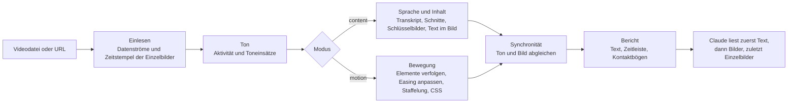

<!-- Sprachleiste. Nur vorhandene README-Dateien aufführen. Übersetzer: Fügen Sie Ihren Link vor der Markierung unten
     im selben Format ein, z. B. · <a href="README.ja.md">日本語</a> -->
<p align="center">
  <a href="README.md">English</a> · <a href="README.ko.md">한국어</a> · <a href="README.ja.md">日本語</a> · <a href="README.zh-CN.md">简体中文</a> · <a href="README.zh-TW.md">繁體中文</a> · <a href="README.es.md">Español</a> · <a href="README.pt-BR.md">Português (Brasil)</a> · <b>Deutsch</b> · <a href="README.fr.md">Français</a>
  <!-- i18n:languages -->
</p>

# video-lens

[](LICENSE)
[](#voraussetzungen)
[](#installation)

Ein Skill für Claude Code, der Videos vermisst, statt sie nach Augenmaß zu beurteilen: Timing und Easing von UI-Animationen als CSS sowie Szenen, Text im Bild und Sprache mit Zeitstempeln. Alles läuft auf Ihrem Mac.

Website mit interaktiven Diagrammen: <https://junhan2.github.io/video-lens/>

## Inhalt

- [Warum](#warum)
- [Wann sich video-lens eignet](#wann-sich-video-lens-eignet)
- [Installation](#installation)
- [Verwendung](#verwendung)
- [Funktionsweise](#funktionsweise)
- [Benchmark-Zusammenfassung](#benchmark-zusammenfassung)
- [Grenzen](#grenzen)
- [Mitwirken und Selbsttest](#mitwirken-und-selbsttest)
- [Lizenz](#lizenz)

## Warum

Claude kann keine Videos ansehen. video-lens vermisst sie Bild für Bild, gibt Claude zuerst Zahlen und Text und zeigt Bilder nur dort, wo ein Blick nötig ist.

- **UI-Bewegung:** Beginn, Dauer, Easing (eine benannte Kurve oder cubic-bezier), Staffelung und Wegstrecke jedes animierten Elements, bildgenau und als CSS ausgeschrieben.
- **Vorträge und Demos:** Szenenwechsel, Schlüsselbilder, koreanischer und englischer Text im Bild (macOS Vision), ein Transkript der Sprache und die Synchronität von Ton und Bild, alles mit Zeitstempeln.
- **Kein Upload:** ffmpeg, OpenCV, macOS Vision, Apples Spracherkennung auf dem Gerät und whisper.cpp.

### Vergleich mit /watch und video-use

| | /watch (claude-video 0.3.2) | video-use (browser-use) | video-lens |
|---|---|---|---|
| Betrachtete Einzelbilder | An Szenenwechseln gewählt (gleichmäßig, wenn es keine gibt), höchstens 100, 512 px breit | 10 Einzelbilder pro angefordertem Abschnitt, 320 px breit, wenn es sie anfordert | Jedes Einzelbild |
| Zeitliche Genauigkeit | Ganze Sekunden | Zeitstempel pro Wort bei Sprache; Einzelbilder zu den angeforderten Zeitpunkten | Ein Einzelbild (16,7 ms bei 60 fps) |
| Eine 300-ms-Animation | 0 oder 1 Einzelbild | Nur die abgetasteten Einzelbilder; Bewegung wird nicht gemessen | Beginn, Dauer, Easing und CSS gemessen |
| Sprache | Zuerst Untertitel; sonst WhisperX auf Ihrem Mac (1,5 GB Installation) oder Upload zu Groq oder OpenAI | Ton wird zu ElevenLabs Scribe hochgeladen (kostenpflichtiger API-Schlüssel) | Auf Ihrem Mac transkribiert, Koreanisch eingeschlossen |
| Szenenwechsel und Text im Bild | Nur zur Bildauswahl; Schnittzeiten und Folientext werden nicht ausgegeben | Nicht erkannt | Zeitpunkte der Schnitte und der Text jeder Folie |

/watch ist für einen schnellen Blick darauf gedacht, worum es in einem Video geht. video-use bearbeitet Videos im Dialog: Schnitte, Farbe und Untertitel. video-lens ist für die Fragen gedacht, wann etwas geschieht, wie lange und auf welche Weise. Im Benchmark erreichte Opus mit /watch 0.3.2 im Mittel denselben Wert wie mit video-lens, hatte aber einen schlechteren schlechtesten Lauf, und mit video-use lag es etwas höher. Beide vermaßen den Clip meist zusätzlich zum Skill mit eigenem ffmpeg- und OpenCV-Code und kosteten etwa das 1,8- und 2,4-Fache. Details: [Vergleich mit anderen Video-Skills](#vergleich-mit-anderen-video-skills).

Beispiel: eine 3 Sekunden lange Aufnahme einer Toast-Meldung, gerendert aus echtem CSS in Headless Chrome. video-lens maß 298 ms (Bereich 284 bis 313) und `cubic-bezier(0.22, 1, 0.36, 1)`. Im CSS standen 300 ms und dieselbe Kurve.

### Vergleich mit dem Modell allein

Ohne den Skill schreibt Claude für jedes Video neuen ffmpeg- und Python-Code und misst damit. Das klappt oft, aber der Code ist bei jedem Durchlauf ein anderer. Wir haben 9 Aufgaben, die anhand von Musterlösungen bewertet werden, je 3-mal ausgeführt, also 27 Durchläufe pro Bedingung, mit und ohne video-lens. Die Zahlen stehen unter [Benchmark-Zusammenfassung](#benchmark-zusammenfassung).

<picture>
  <source media="(prefers-color-scheme: dark)" srcset="docs/assets/charts/cost-dark.png">
  
</picture>

<picture>
  <source media="(prefers-color-scheme: dark)" srcset="docs/assets/charts/time-dark.png">
  
</picture>

<picture>
  <source media="(prefers-color-scheme: dark)" srcset="docs/assets/charts/accuracy-dark.png">
  
</picture>

## Wann sich video-lens eignet

Geeignet für:

- **UI-Bewegung nachbauen oder prüfen.** Beginn, Dauer, Easing und Staffelung als Zahlen und CSS, jeweils mit dem Bereich, in dem der Wert liegen kann. „Ist dieser Übergang wirklich 400 ms ease-out?“ bekommt eine gemessene Antwort.
- **Lange Aufnahmen.** <!-- long-lecture:start -->Beim 10 Minuten langen Vortrag auf Koreanisch, Claude Opus 5.5 mit video-lens: Kosten 30 % niedriger, Zeit 74 % niedriger (Median aus 3 Durchläufen).<!-- long-lecture:end -->
- **Wiederholte Bewegung.** Karussells und Schleifen werden einmal als Gruppe gemessen, mit der Startzeit jeder Wiederholung.
- **Vertrauliche Vorträge und Besprechungen.** Die Sprache wird auf Ihrem Mac transkribiert, und der Text der Folien kommt mit Zeitstempeln.

Nicht nötig für:

- **Schneller Überblick über einen kurzen Clip.** Das schafft das Modell allein, und das Laden des Skills erhöht die Kosten ein wenig.
- **Windows oder Linux.** video-lens läuft nur unter macOS.
- **Sprecherzuordnung, Bestimmung der Sprache oder Musiktempo.** Das wird nicht unterstützt.

## Installation

In Claude Code:

```
/plugin marketplace add Junhan2/video-lens
/plugin install video-lens@video-lens
```

Im Terminal:

```
brew install ffmpeg
python3 -m pip install opencv-python numpy
xcode-select --install   # baut die Hilfsprogramme für Text im Bild und Sprache
```

### Voraussetzungen

| | Was | Hinweise |
|---|---|---|
| Erforderlich | macOS | Getestet unter macOS 26 mit Apple Silicon. |
| Erforderlich | ffmpeg | |
| Erforderlich | Python 3.10 oder neuer mit opencv-python und numpy | Getestet mit Python 3.13, OpenCV 4.12 und numpy 2.2. Lehnt pip mit `externally-managed-environment` ab (Python von Homebrew), hängen Sie `--user --break-system-packages` an. Fehlt ein Paket oder ist Python zu alt, wird die genaue Lösung ausgegeben. |
| Erforderlich | Xcode Command Line Tools | Baut die Hilfsprogramme für Text im Bild und Sprache. |
| Optional | macOS 26 | Spracherkennung auf dem Gerät (Apple SpeechTranscriber). |
| Optional | whisper-cpp und ein ggml-Modell | Zum Beispiel `ggml-large-v3-turbo-q5_0.bin` in `~/.local/share/whisper/`, um mit whisper zu transkribieren. |
| Optional | Node 24 und Google Chrome | Liest die deklarierten CSS-Animationen einer Webseite aus und vergleicht sie mit der Messung. |
| Optional | yt-dlp | Analysiert ein Video über eine URL. |

## Verwendung

Fragen Sie wie gewohnt. Claude wählt den Skill, wenn eine Frage eine Messung erfordert. Um ihn direkt aufzurufen, beginnen Sie Ihre Nachricht mit `/video-lens`.

```
Analysiere die Animation in dieser Bildschirmaufnahme, damit ich sie in CSS nachbauen kann
Liste auf, wann in diesem Vortrag welche Folie erscheint und was darauf steht
Was wurde ungefähr bei 12:00 gesagt?
Fasse diesen YouTube-Vortrag Szene für Szene mit Screenshots zusammen
```

In einem Test, bei dem der Prompt den Skill nicht nannte, wählte Opus 5.5 ihn bei 8 von 9 Aufgaben von sich aus.

Wenn sich mehrere Elemente gleichzeitig bewegen, nennen Sie den Bereich, zum Beispiel „nur die Liste links“. Claude grenzt die Messung dann mit `--roi` ein.

### Szenenübersicht, nur auf Anfrage

Bitten Sie um eine Zusammenfassung Szene für Szene mit Screenshots, dann schreibt Claude `digest.md` und eine eigenständige `digest.html`: ein Standbild pro Szene, ein oder zwei Zeilen dazu, was passiert, was gesagt wurde, und einen Link zu genau dieser Stelle. Ein YouTube-Video mit Kapiteln wird nach seinen Kapiteln aufgeteilt. Bei einem 66 Minuten langen Vortrag auf Koreanisch mit 21 Kapiteln dauerte das auf dem Mac etwa 4 Minuten (Download, Analyse und Übersicht). Gewöhnliche Analysen erzeugen nie eine solche Übersicht.

## Funktionsweise

Ein einziger Befehl, `vl.py analyze`, vermisst das Video und gibt einen Textbericht von höchstens 6000 Zeichen aus. Claude liest zuerst diesen Bericht, dann einige beschriftete Bilder und Einzelbilder nur dann, wenn es nötig ist.



- **Modus:** Ein stiller Clip von bis zu 2 Minuten wird als Bewegung (motion) gemessen, ein längerer als Inhalt (content), und ein kurzer Clip mit Ton bekommt beides.
- **Reihenfolge bei Sprache:** eine Untertitelspur, dann eine daneben liegende `.srt`- oder `.vtt`-Datei, dann Apple SpeechTranscriber auf dem Gerät, dann whisper.cpp. Der Ton wird nie hochgeladen.
- **Bewegung:** OpenCV findet die bewegten Elemente und verfolgt sie Bild für Bild; Beginn, Dauer, Easing, Staffelung und Wegstrecke werden durch Kurvenanpassung ermittelt, wobei Bereiche und nahezu gleichwertige Alternativen mit angegeben werden.

## Benchmark-Zusammenfassung

<!-- results:start -->
<!-- Generated from docs/data/benchmark.json by tools/render_results.py. Do not edit by hand. -->

| Modell | Bedingung | Mittlere Punktzahl | Schlechtester Durchlauf | Durchläufe mit 1,0 | Mittlere Kosten pro Durchlauf | Mittlere Zeit pro Durchlauf | Mittlere Zahl der Runden |
| --- | --- | ---: | ---: | ---: | ---: | ---: | ---: |
| Claude Opus 5.5 | Modell allein | 0,949 | 0,167 | 21/27 | 0,859 $ | 420,2 s | 17,5 |
| Claude Opus 5.5 | Mit video-lens | 0,956 | 0,800 | 15/27 | 0,663 $ | 265,1 s | 10,1 |
| Claude Sonnet 5.5 | Modell allein | 0,970 | 0,600 | 22/27 | 0,626 $ | 287,9 s | 20,9 |
| Claude Sonnet 5.5 | Mit video-lens | 0,940 | 0,625 | 15/27 | 0,408 $ | 121,8 s | 10,0 |
| Grok 4.7 | Modell allein | 0,819 | 0,000 | 14/27 | 0,444 $ | 785,0 s | 23,3 |
| Grok 4.7 | Mit video-lens | 0,942 | 0,667 | 14/27 | 0,324 $ | 1055,9 s | 17,7 |

- Claude Opus 5.5 mit video-lens: Kosten 23 % niedriger, Zeit 37 % niedriger.
- Claude Sonnet 5.5 mit video-lens: Kosten 35 % niedriger, Zeit 58 % niedriger.
- Grok 4.7 mit video-lens: Kosten 27 % niedriger, Zeit 35 % höher.

Messzeitraum 2026-09-29 bis 2026-10-03. 9 Aufgaben × 3 Durchläufe = 27 Durchläufe pro Bedingung, ohne MCP-Server, ein Durchlauf nach dem anderen. Mittlere Punktzahl, Kosten, Zeit und Runden sind Mittelwerte über alle Durchläufe; der schlechteste Durchlauf ist die niedrigste einzelne Punktzahl.

- Claude Opus 5.5: ausgeführt in Claude Code, Effort-Stufe high. Die Kosten sind der API-äquivalente Wert `total_cost_usd`, den Claude Code meldet. Die Zeit ist die Laufzeit, die Claude Code meldet.
- Claude Sonnet 5.5: ausgeführt in Claude Code, Effort-Stufe high. Die Kosten sind der API-äquivalente Wert `total_cost_usd`, den Claude Code meldet. Die Zeit ist die Laufzeit, die Claude Code meldet.
- Grok 4.7: ausgeführt in Grok Build CLI, Effort-Stufe xhigh. Die Kosten sind der API-äquivalente Wert `total_cost_usd`, den Grok Build CLI meldet. Die Zeit ist die real verstrichene Dauer des Durchlaufs.

<!-- results:end -->

Die Zeit von Grok 4.7 mit video-lens ist nur ein grober Wert: Diese Durchläufe teilten sich den Mac während eines Teils der Messreihe mit anderer rechenintensiver Arbeit, und einer davon dauerte 4,3 Stunden. Der Median der Laufzeit lag bei 446 s, gegenüber 778 s für das Modell allein.

<picture>
  <source media="(prefers-color-scheme: dark)" srcset="docs/assets/charts/tasks-dark.png">
  
</picture>

### Vergleich mit anderen Video-Skills

<!-- skills:start -->
<!-- Generated from docs/data/benchmark.json by tools/render_results.py. Do not edit by hand. -->

Claude Opus 5.5 mit jedem Video-Skill bei denselben 9 Aufgaben und Prompts, 27 Durchläufe pro Bedingung, ein Durchlauf nach dem anderen. Jeder Durchlauf nannte seinen Skill im Prompt, und video-lens war für die Durchläufe der anderen Skills verborgen.

| Bedingung | Mittlere Punktzahl | Schlechtester Durchlauf | Durchläufe mit 1,0 | Mittlere Kosten pro Durchlauf | Mittlere Zeit pro Durchlauf | Mittlere Zahl der Runden | Durchläufe mit eigenem Analysecode |
| --- | ---: | ---: | ---: | ---: | ---: | ---: | ---: |
| Modell allein | 0,949 | 0,167 | 21/27 | 0,859 $ | 420,2 s | 17,5 | 26/27 |
| Mit video-lens | 0,956 | 0,800 | 15/27 | 0,663 $ | 265,1 s | 10,1 | 2/27 |
| Mit /watch | 0,956 | 0,467 | 22/27 | 1,198 $ | 505,0 s | 22,3 | 23/27 |
| Mit video-use | 0,969 | 0,467 | 23/27 | 1,569 $ | 487,2 s | 22,1 | 27/27 |

- /watch (claude-video 0.3.2) wählt Bilder an Szenenwechseln, höchstens 100, und transkribiert ohne Untertitel mit WhisperX auf dem Mac oder der Whisper-API von Groq oder OpenAI. Diese Läufe nutzten Groq, den bereits eingerichteten Schlüssel.
- video-use (browser-use/video-use b877063) ist zum Bearbeiten von Videos gebaut, nicht zum Vermessen. Es schickt Sprache an ElevenLabs Scribe und betrachtet Filmstreifen aus Einzelbildern. Diese Aufgaben prüfen nur, wie gut es ein Video erfasst.
- Eigener Analysecode: Durchläufe, in denen Opus neben den Werkzeugen des Skills auch eigene ffmpeg-, OpenCV- oder whisper-Befehle schrieb und ausführte. Die meisten Durchläufe mit /watch und video-use taten das, und dorthin gingen ihre zusätzlichen Kosten und ihre zusätzliche Zeit. Mit video-lens reichten die Messungen des Skills meist aus.
- Die Kosten umfassen nur, was Claude Code für das Modell meldet. Die Sprach-APIs, die /watch (Groq oder OpenAI) und video-use (ElevenLabs) aufrufen, werden über deren eigene Schlüssel abgerechnet und sind nicht enthalten.

<!-- skills:end -->

Die Musterlösungen stammen aus echten CSS-Animationen, Bild für Bild in Headless Chrome gerendert (die richtige Antwort ist das CSS, wie es geschrieben steht), und aus Vorträgen, die mit der Sprachausgabe von macOS vertont wurden; die Karussell-Aufgabe ist eine echte Aufnahme mit einer ungefähren Musterlösung. Toleranzen: Beginn und Dauer ±1 Einzelbild, Easing mit höchstens 0,05 Abweichung von der tatsächlichen Kurve, Töne ±10 ms, Zeitangaben der Sprache ±150 ms.

Methode, Ergebnisse pro Aufgabe und Einschränkungen: [docs/BENCHMARK.md](docs/BENCHMARK.md). Skripte und Rohdaten: [bench/](bench/README.md).

## Grenzen

- Mehrere gleichzeitig bewegte Elemente können im ersten Durchgang zu einem Rahmen verschmelzen oder in Bruchstücke zerfallen. Eine Eingrenzung des Bereichs mit `--roi` behebt das. Im Benchmark tat Opus 5.5 das von sich aus; Sonnet 5.5 tat es seltener.
- Bewegung vor Foto- oder Verlaufshintergründen und verrauschte Sprache aus echten Aufnahmen sind zu wenig getestet.
- Keine Sprecherzuordnung, keine automatische Bestimmung der Sprache, kein Musiktempo.
- Aufnahmen mit 30 fps halbieren die zeitliche Auflösung. Nehmen Sie nach Möglichkeit mit 60 fps auf.
- Nur macOS, getestet unter macOS 26 mit Apple Silicon.

## Mitwirken und Selbsttest

- **Selbsttest:** `python3 skills/video-lens/scripts/vl.py selftest` führt Prüfungen mit bekannten Ergebnissen an synthetischen Clips aus und endet bei jedem Fehlschlag mit dem Exit-Code 1. `--quick` führt einen kürzeren Satz aus.
- **Die Benchmark-Zahlen** liegen in einer einzigen Datei, [`docs/data/benchmark.json`](docs/data/benchmark.json). Jedes Modell hat dort einen `settings`-Block (Ausführungsumgebung, Effort-Stufe, wie Kosten und Zeit erfasst wurden), aus dem die Einrichtungszeilen pro Modell erzeugt werden. Führen Sie nach einer Änderung der Datei `python3 tools/render_results.py` aus (schreibt den Text zwischen den Markierungen `results`, `per-task`, `tasks` und `long-lecture` in jeder README- und BENCHMARK-Datei sowie die berechneten Sätze in `docs/index.html` neu; `--check` meldet nur) und `node tools/render_charts.mjs` (rendert die Diagrammbilder mit Headless Chrome neu).
- **Übersetzungen:** Kopieren Sie `docs/i18n/en.json` nach `docs/i18n/<lang>.json`, übersetzen Sie die Werte, tragen Sie die Sprache in `docs/i18n/languages.json` ein und führen Sie `python3 tools/i18n.py check` aus. Für eine übersetzte README legen Sie `README.<lang>.md` mit denselben Markierungen an und führen `python3 tools/render_results.py` aus; ihre Tabellen verwenden dann Ihre Beschriftungen. Führen Sie nach Änderungen an `en.json` oder `languages.json` die Befehle `python3 tools/i18n.py sync` und `python3 tools/render_results.py` aus, damit das eingebaute Englisch der Seite und ihre Sprachlinks übereinstimmen.

## Lizenz

[MIT](LICENSE)
