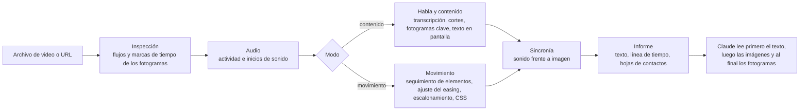

<!-- Barra de idiomas. Incluye solo los archivos README que existen. Si traduces, añade tu enlace antes del marcador de abajo,
     con el mismo formato, p. ej. · <a href="README.ja.md">日本語</a> -->
<p align="center">
  <a href="README.md">English</a> · <a href="README.ko.md">한국어</a> · <a href="README.ja.md">日本語</a> · <a href="README.zh-CN.md">简体中文</a> · <a href="README.zh-TW.md">繁體中文</a> · <b>Español</b> · <a href="README.pt-BR.md">Português (Brasil)</a> · <a href="README.de.md">Deutsch</a> · <a href="README.fr.md">Français</a>
  <!-- i18n:languages -->
</p>

# video-lens

[](LICENSE)
[](#requisitos)
[](#instalación)

Una skill de Claude Code que mide el video en lugar de calcularlo a ojo: tiempos y easing de animaciones de interfaz como CSS, y escenas, texto en pantalla y habla con marcas de tiempo. Todo se ejecuta en tu Mac.

Sitio web con gráficos interactivos: <https://junhan2.github.io/video-lens/>

## Contenido

- [Por qué](#por-qué)
- [Cuándo usarla](#cuándo-usarla)
- [Instalación](#instalación)
- [Uso](#uso)
- [Cómo funciona](#cómo-funciona)
- [Resumen del benchmark](#resumen-del-benchmark)
- [Limitaciones](#limitaciones)
- [Contribuciones y autoprueba](#contribuciones-y-autoprueba)
- [Licencia](#licencia)

## Por qué

Claude no puede ver videos. video-lens los mide fotograma a fotograma, le entrega a Claude primero números y texto, y solo muestra imágenes donde hace falta mirar.

- **Movimiento de interfaz:** inicio, duración, easing (una curva con nombre o cubic-bezier), escalonamiento y desplazamiento de cada elemento animado, con precisión de fotograma, escritos como CSS.
- **Charlas y demos:** cortes de escena, fotogramas clave, texto en pantalla en coreano e inglés (macOS Vision), una transcripción del habla y la sincronía entre audio y video, todo con marcas de tiempo.
- **No se sube nada:** ffmpeg, OpenCV, macOS Vision, el reconocimiento de voz en el dispositivo de Apple y whisper.cpp.

### Comparación con /watch y video-use

| | /watch (claude-video 0.1.3) | video-use (browser-use) | video-lens |
|---|---|---|---|
| Fotogramas que revisa | Como máximo 2 por segundo, 100 en total | 10 fotogramas por rango solicitado, de 320 px de ancho, cuando los pide | Todos los fotogramas |
| Precisión temporal | Segundos enteros | Marcas de tiempo por palabra para el habla; fotogramas en los momentos que pide | Un fotograma (16.7 ms a 60 fps) |
| Una animación de 300 ms | 0 o 1 fotogramas | Solo los fotogramas que muestrea; el movimiento no se mide | Inicio, duración, easing y CSS medidos |
| Habla | El audio se sube a Groq u OpenAI Whisper, salvo que haya subtítulos en inglés | El audio se sube a ElevenLabs Scribe (clave de API de pago) | Se transcribe en tu Mac, también en coreano |
| Cortes de escena y texto en pantalla | No se detectan | No se detectan | El momento de cada corte y el texto de cada diapositiva |

/watch está pensado para ver rápidamente de qué trata un video. video-use edita videos conversando: cortes, color y subtítulos. video-lens sirve para saber cuándo ocurre algo, durante cuánto tiempo y cómo. En el benchmark, Opus con /watch o video-use obtuvo en promedio una puntuación un poco más alta que con video-lens, sobre todo porque, además de usar la skill, midió el clip por su cuenta con su propio código de ffmpeg y OpenCV, y costó más del doble. Detalles: [Frente a otras skills de video](#frente-a-otras-skills-de-video).

Ejemplo: una grabación de 3 segundos de un toast renderizado a partir de CSS real en Chrome headless. video-lens midió 298 ms (rango de 284 a 313) y `cubic-bezier(0.22, 1, 0.36, 1)`. El CSS indicaba 300 ms y la misma curva.

### Comparación con el modelo por sí solo

Sin la skill, Claude escribe código nuevo de ffmpeg y Python para cada video y mide con él. A menudo funciona, pero el código cambia en cada ejecución. Probamos 9 tareas evaluadas con claves de respuestas, 3 ejecuciones de cada una, es decir, 27 ejecuciones por condición, con y sin video-lens. Las cifras están en [Resumen del benchmark](#resumen-del-benchmark).

<picture>
  <source media="(prefers-color-scheme: dark)" srcset="docs/assets/charts/cost-dark.png">
  
</picture>

<picture>
  <source media="(prefers-color-scheme: dark)" srcset="docs/assets/charts/time-dark.png">
  
</picture>

<picture>
  <source media="(prefers-color-scheme: dark)" srcset="docs/assets/charts/accuracy-dark.png">
  
</picture>

## Cuándo usarla

Úsala para:

- **Recrear o revisar el movimiento de una interfaz.** Inicio, duración, easing y escalonamiento como números y CSS, cada uno con el rango en el que podría estar. "¿Esta transición es realmente de 400 ms ease-out?" recibe una respuesta medida.
- **Grabaciones largas.** <!-- long-lecture:start -->En la clase de 10 minutos en coreano, Claude Opus 5.5 con video-lens: costo un 30 % menor, tiempo un 74 % menor (mediana de 3 ejecuciones).<!-- long-lecture:end -->
- **Movimiento repetido.** Los carruseles y bucles se miden una sola vez como grupo, con el momento de inicio de cada repetición.
- **Charlas y reuniones privadas.** El habla se transcribe en tu Mac, y el texto de las diapositivas viene con marcas de tiempo.

No la necesitas para:

- **Captar rápido la idea general de un clip corto.** El modelo por sí solo lo resuelve, y cargar la skill añade un poco de costo.
- **Windows o Linux.** video-lens solo funciona en macOS.
- **Etiquetas de hablante, detección de idioma o tempo musical.** No se admiten.

## Instalación

En Claude Code:

```
/plugin marketplace add Junhan2/video-lens
/plugin install video-lens@video-lens
```

En una terminal:

```
brew install ffmpeg
pip3 install opencv-python numpy
xcode-select --install   # compila las herramientas auxiliares de texto en pantalla y de voz
```

### Requisitos

| | Qué | Notas |
|---|---|---|
| Obligatorio | macOS | Probado en macOS 26 con Apple Silicon. |
| Obligatorio | ffmpeg | |
| Obligatorio | Python 3 con opencv-python y numpy | Probado con Python 3.13. Si falta un paquete, se muestra el comando de pip exacto. |
| Obligatorio | Xcode Command Line Tools | Compila las herramientas auxiliares de texto en pantalla y de voz. |
| Opcional | macOS 26 | Reconocimiento de voz en el dispositivo (Apple SpeechTranscriber). |
| Opcional | whisper-cpp y un modelo ggml | Por ejemplo, `ggml-large-v3-turbo-q5_0.bin` en `~/.local/share/whisper/`, para transcribir con whisper. |
| Opcional | Node 24 y Google Chrome | Lee las animaciones CSS declaradas de una página web y las compara con la medición. |
| Opcional | yt-dlp | Analiza un video desde una URL. |

## Uso

Pregunta como siempre. Claude elige la skill cuando una pregunta requiere medir. Para invocarla directamente, empieza tu mensaje con `/video-lens`.

```
Analiza la animación de esta grabación de pantalla para que pueda recrearla en CSS
Enumera cuándo aparece cada diapositiva en esta clase y qué dice
¿Qué se dijo alrededor del minuto 12:00?
Resume esta charla de YouTube escena por escena con capturas de pantalla
```

En una prueba en la que el prompt no nombraba la skill, Opus 5.5 la eligió por su cuenta en 8 de 9 tareas.

Cuando varios elementos se mueven a la vez, indica la zona, por ejemplo "solo la lista de la izquierda". Así Claude acota la medición con `--roi`.

### Resumen por escenas, solo si lo pides

Pide un resumen escena por escena con capturas de pantalla y Claude escribe `digest.md` y un `digest.html` autocontenido: una captura por escena, una o dos líneas sobre lo que ocurre, lo que se dijo y un enlace a ese momento. Un video de YouTube con capítulos se divide por sus capítulos. Con una charla de 66 minutos en coreano y 21 capítulos, esto tardó unos 4 minutos en el Mac (descarga, análisis y resumen). Los análisis normales nunca generan uno.

## Cómo funciona

Un solo comando, `vl.py analyze`, mide el video y genera un informe de texto de 6000 caracteres como máximo. Claude lee eso primero, luego unas pocas imágenes etiquetadas y, solo cuando hace falta, fotogramas sueltos.



- **Modo:** un clip silencioso de hasta 2 minutos se mide como movimiento; uno más largo, como contenido; y un clip corto con sonido recibe ambos.
- **Fuentes del habla, en orden:** una pista de subtítulos, luego un archivo `.srt` o `.vtt` junto al video, después Apple SpeechTranscriber en el dispositivo y, por último, whisper.cpp. El audio nunca se sube.
- **Movimiento:** OpenCV encuentra los elementos en movimiento y los sigue fotograma a fotograma; el inicio, la duración, el easing, el escalonamiento y el desplazamiento se ajustan, y el informe incluye los rangos y los casi empates.

## Resumen del benchmark

<!-- results:start -->
<!-- Generated from docs/data/benchmark.json by tools/render_results.py. Do not edit by hand. -->

| Modelo | Condición | Puntuación media | Peor ejecución | Ejecuciones con 1.0 | Costo medio por ejecución | Tiempo medio por ejecución | Turnos medios |
| --- | --- | ---: | ---: | ---: | ---: | ---: | ---: |
| Claude Opus 5.5 | Modelo por sí solo | 0.949 | 0.167 | 21/27 | 0.859 US$ | 420.2 s | 17.5 |
| Claude Opus 5.5 | Con video-lens | 0.956 | 0.800 | 15/27 | 0.663 US$ | 265.1 s | 10.1 |
| Claude Sonnet 5.5 | Modelo por sí solo | 0.970 | 0.600 | 22/27 | 0.626 US$ | 287.9 s | 20.9 |
| Claude Sonnet 5.5 | Con video-lens | 0.940 | 0.625 | 15/27 | 0.408 US$ | 121.8 s | 10.0 |
| Grok 4.7 | Modelo por sí solo | 0.819 | 0.000 | 14/27 | 0.444 US$ | 785.0 s | 23.3 |
| Grok 4.7 | Con video-lens | 0.942 | 0.667 | 14/27 | 0.324 US$ | 1055.9 s | 17.7 |

- Claude Opus 5.5 con video-lens: costo un 23 % menor, tiempo un 37 % menor.
- Claude Sonnet 5.5 con video-lens: costo un 35 % menor, tiempo un 58 % menor.
- Grok 4.7 con video-lens: costo un 27 % menor, tiempo un 35 % mayor.

Medido del 2026-09-29 al 2026-10-01. 9 tareas × 3 ejecuciones = 27 ejecuciones por condición, sin servidores MCP, una ejecución a la vez. La puntuación media, el costo, el tiempo y los turnos son medias de todas las ejecuciones; la peor ejecución es la puntuación individual más baja.

- Claude Opus 5.5: ejecutado en Claude Code, esfuerzo high. El costo es el `total_cost_usd`, equivalente a precios de API, que informa Claude Code. El tiempo es la duración de la ejecución que informa Claude Code.
- Claude Sonnet 5.5: ejecutado en Claude Code, esfuerzo high. El costo es el `total_cost_usd`, equivalente a precios de API, que informa Claude Code. El tiempo es la duración de la ejecución que informa Claude Code.
- Grok 4.7: ejecutado en Grok Build CLI, esfuerzo xhigh. El costo es el `total_cost_usd`, equivalente a precios de API, que informa Grok Build CLI. El tiempo es la duración real transcurrida de la ejecución.

<!-- results:end -->

El tiempo de Grok 4.7 con video-lens es aproximado: durante parte de la ronda, esas ejecuciones compartieron máquina con otras tareas pesadas, y una de ellas tardó 4.3 horas. Su tiempo mediano fue de 446 s, frente a 778 s por sí solo.

<picture>
  <source media="(prefers-color-scheme: dark)" srcset="docs/assets/charts/tasks-dark.png">
  
</picture>

### Frente a otras skills de video

<!-- skills:start -->
<!-- Generated from docs/data/benchmark.json by tools/render_results.py. Do not edit by hand. -->

Claude Opus 5.5 con cada skill de video en las mismas 9 tareas y con los mismos prompts, 27 ejecuciones por condición, una ejecución a la vez. Cada ejecución nombraba su skill en el prompt, y video-lens quedó oculta en las ejecuciones de las otras skills.

| Condición | Puntuación media | Peor ejecución | Ejecuciones con 1.0 | Costo medio por ejecución | Tiempo medio por ejecución | Turnos medios | Ejecuciones con código de análisis propio |
| --- | ---: | ---: | ---: | ---: | ---: | ---: | ---: |
| Modelo por sí solo | 0.949 | 0.167 | 21/27 | 0.859 US$ | 420.2 s | 17.5 | 26/27 |
| Con video-lens | 0.956 | 0.800 | 15/27 | 0.663 US$ | 265.1 s | 10.1 | 2/27 |
| Con /watch | 0.984 | 0.800 | 23/27 | 1.773 US$ | 590.0 s | 34.7 | 24/27 |
| Con video-use | 0.969 | 0.467 | 23/27 | 1.569 US$ | 487.2 s | 22.1 | 27/27 |

- /watch (claude-video 0.1.3) revisa hasta 2 fotogramas por segundo y envía el habla a la API de Groq o de OpenAI Whisper.
- video-use (browser-use/video-use b877063) está hecho para editar videos, no para medirlos. Envía el habla a ElevenLabs Scribe y revisa tiras de fotogramas. Estas tareas solo evalúan qué tan bien lee un video.
- Código de análisis propio: ejecuciones en las que Opus, además de usar las herramientas de la skill, escribió y ejecutó sus propios comandos de ffmpeg, OpenCV o whisper. La mayoría de las ejecuciones con /watch y video-use lo hicieron, y ahí se fueron su costo y su tiempo adicionales. Con video-lens, las mediciones de la skill solían bastar.
- El costo solo incluye lo que Claude Code informa para el modelo. Las API de voz a las que llaman /watch (Groq u OpenAI) y video-use (ElevenLabs) se facturan a sus propias claves y no están incluidas.

<!-- skills:end -->

Las claves de respuestas provienen de animaciones CSS reales renderizadas fotograma a fotograma en Chrome headless (la verdad es el CSS tal como está escrito) y de clases narradas con la síntesis de voz de macOS; la tarea del carrusel es una grabación real con una clave aproximada. Tolerancias: inicio y duración ±1 fotograma, easing a no más de 0.05 de la curva real, sonidos ±10 ms, tiempos del habla ±150 ms.

Método, resultados por tarea y salvedades: [docs/BENCHMARK.md](docs/BENCHMARK.md). Scripts y resultados sin procesar: [bench/](bench/README.md).

## Limitaciones

- Cuando varios elementos se mueven a la vez, en la primera pasada pueden salir fusionados en un solo recuadro o partidos en fragmentos. Acotar la zona con `--roi` lo soluciona. En el benchmark, Opus 5.5 lo hizo por su cuenta; Sonnet 5.5 lo hizo con menos frecuencia.
- El movimiento sobre fondos de foto o con degradado y el habla real con ruido están poco probados.
- Sin etiquetas de hablante, detección automática de idioma ni tempo musical.
- Las grabaciones a 30 fps reducen a la mitad la resolución temporal. Graba a 60 fps cuando puedas.
- Solo macOS, probado en macOS 26 con Apple Silicon.

## Contribuciones y autoprueba

- **Autoprueba:** `python3 skills/video-lens/scripts/vl.py selftest` ejecuta comprobaciones con respuesta conocida sobre clips sintéticos y termina con código 1 si alguna falla. `--quick` ejecuta un conjunto más corto.
- **Las cifras del benchmark** están en un solo archivo, [`docs/data/benchmark.json`](docs/data/benchmark.json). Ahí cada modelo tiene un bloque `settings` (harness, esfuerzo, cómo se tomaron el costo y el tiempo) a partir del cual se generan las líneas de configuración de cada modelo. Después de cambiar el archivo, ejecuta `python3 tools/render_results.py` (reescribe el texto entre los marcadores `results`, `per-task`, `tasks` y `long-lecture` en todos los archivos README y BENCHMARK, y las frases calculadas de `docs/index.html`; con `--check` solo informa) y `node tools/render_charts.mjs` (vuelve a generar las imágenes de los gráficos con Chrome headless).
- **Traducciones:** copia `docs/i18n/en.json` a `docs/i18n/<lang>.json`, traduce los valores, añade el idioma a `docs/i18n/languages.json` y ejecuta `python3 tools/i18n.py check`. Para un README traducido, crea `README.<lang>.md` con los mismos marcadores y ejecuta `python3 tools/render_results.py`; así sus tablas usarán tus etiquetas. Después de editar `en.json` o `languages.json`, ejecuta `python3 tools/i18n.py sync` y `python3 tools/render_results.py` para que el inglés integrado de la página y sus enlaces de idioma coincidan.

## Licencia

[MIT](LICENSE)
