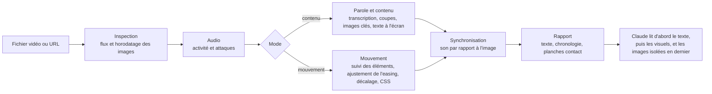

<!-- Barre des langues. N'y indiquez que les fichiers README qui existent. Traducteurs : ajoutez votre lien avant le marqueur ci-dessous,
     sous la même forme, par exemple · <a href="README.ja.md">日本語</a> -->
<p align="center">
  <a href="README.md">English</a> · <a href="README.ko.md">한국어</a> · <a href="README.ja.md">日本語</a> · <a href="README.zh-CN.md">简体中文</a> · <a href="README.zh-TW.md">繁體中文</a> · <a href="README.es.md">Español</a> · <a href="README.pt-BR.md">Português (Brasil)</a> · <a href="README.de.md">Deutsch</a> · <b>Français</b>
  <!-- i18n:languages -->
</p>

# video-lens

[](LICENSE)
[](#prérequis)
[](#installation)

Un skill Claude Code qui mesure la vidéo au lieu de l'estimer à l'œil : timing et easing des animations d'interface en CSS, ainsi que scènes, texte à l'écran et parole horodatés. Tout tourne sur votre Mac.

Site web avec graphiques interactifs : <https://junhan2.github.io/video-lens/>

## Sommaire

- [Pourquoi](#pourquoi)
- [Quand l'utiliser](#quand-lutiliser)
- [Installation](#installation)
- [Utilisation](#utilisation)
- [Fonctionnement](#fonctionnement)
- [Résumé du benchmark](#résumé-du-benchmark)
- [Limites](#limites)
- [Contribuer et auto-test](#contribuer-et-auto-test)
- [Licence](#licence)

## Pourquoi

Claude ne peut pas regarder une vidéo. video-lens la mesure image par image, fournit d'abord à Claude des chiffres et du texte, et ne lui montre des images que là où un coup d'œil est nécessaire.

- **Mouvement d'interface :** début, durée, easing (courbe nommée ou cubic-bezier), décalage (stagger) et déplacement de chaque élément animé, à l'image près, rédigés en CSS.
- **Présentations et démos :** changements de scène, images clés, texte à l'écran en coréen et en anglais (macOS Vision), transcription de la parole et synchronisation audio/vidéo, le tout horodaté.
- **Aucun envoi en ligne :** ffmpeg, OpenCV, macOS Vision, la reconnaissance vocale sur l'appareil d'Apple et whisper.cpp.

### Comparaison avec /watch et video-use

| | /watch (claude-video 0.3.2) | video-use (browser-use) | video-lens |
|---|---|---|---|
| Images examinées | Choisies aux changements de scène (réparties s'il n'y en a pas), 100 au plus, 512 px de large | 10 images par plage demandée, larges de 320 px, quand il les demande | Toutes les images |
| Précision temporelle | À la seconde | Horodatage de chaque mot pour la parole ; images aux instants qu'il demande | Une image (16,7 ms à 60 fps) |
| Une animation de 300 ms | 0 ou 1 image | Seulement les images qu'il échantillonne ; le mouvement n'est pas mesuré | Début, durée, easing et CSS mesurés |
| Parole | Sous-titres d'abord ; sinon WhisperX sur votre Mac (une installation de 1,5 Go) ou envoi à Groq ou OpenAI | Audio envoyé à ElevenLabs Scribe (clé d'API payante) | Transcrite sur votre Mac, coréen compris |
| Changements de scène et texte à l'écran | Sert seulement à choisir les images ; ni les moments des coupes ni le texte des diapositives ne sont donnés | Non détectés | Instants des coupes et texte de chaque diapositive |

/watch est conçu pour voir rapidement de quoi parle une vidéo. video-use monte des vidéos par la conversation : coupes, couleur et sous-titres. video-lens sert à savoir quand quelque chose se produit, pendant combien de temps et comment. Dans le benchmark, Opus avec /watch 0.3.2 a égalé la moyenne de video-lens mais avec une pire exécution plus basse, et avec video-use il a obtenu un peu plus. Les deux ont surtout mesuré le clip avec leur propre code ffmpeg et OpenCV en plus du skill, et ont coûté environ 1,8 et 2,4 fois plus. Détails : [Face aux autres skills vidéo](#face-aux-autres-skills-vidéo).

Exemple : l'enregistrement d'un toast de 3 secondes, rendu à partir de vrai CSS dans Chrome headless. video-lens a mesuré 298 ms (plage de 284 à 313) et `cubic-bezier(0.22, 1, 0.36, 1)`. Le CSS indiquait 300 ms et la même courbe.

### Comparaison avec le modèle seul

Sans le skill, Claude écrit du nouveau code ffmpeg et Python pour chaque vidéo et s'en sert pour mesurer. Cela marche souvent, mais le code change à chaque exécution. Nous avons lancé 9 tâches notées à l'aide d'un corrigé, 3 exécutions chacune, soit 27 exécutions par condition, avec et sans video-lens. Les chiffres se trouvent dans le [Résumé du benchmark](#résumé-du-benchmark).

<picture>
  <source media="(prefers-color-scheme: dark)" srcset="docs/assets/charts/cost-dark.png">
  
</picture>

<picture>
  <source media="(prefers-color-scheme: dark)" srcset="docs/assets/charts/time-dark.png">
  
</picture>

<picture>
  <source media="(prefers-color-scheme: dark)" srcset="docs/assets/charts/accuracy-dark.png">
  
</picture>

## Quand l'utiliser

Utilisez-le pour :

- **Reproduire ou vérifier un mouvement d'interface.** Début, durée, easing et décalage sous forme de chiffres et de CSS, chacun avec la plage dans laquelle il peut se situer. « Cette transition fait-elle vraiment 400 ms en ease-out ? » obtient une réponse mesurée.
- **Enregistrements longs.** <!-- long-lecture:start -->Sur le cours de 10 minutes en coréen, Claude Opus 5.5 avec video-lens : coût en baisse de 30 %, durée en baisse de 74 % (médiane de 3 exécutions).<!-- long-lecture:end -->
- **Mouvements répétés.** Carrousels et boucles sont mesurés une seule fois, comme un groupe, avec l'instant de départ de chaque répétition.
- **Présentations et réunions privées.** La parole est transcrite sur votre Mac, et le texte des diapositives est horodaté.

Vous n'en avez pas besoin pour :

- **Saisir rapidement l'essentiel d'un court extrait.** Le modèle seul s'en charge, et charger le skill ajoute un peu de coût.
- **Windows ou Linux.** video-lens fonctionne uniquement sous macOS.
- **Identification des locuteurs, détection de la langue ou tempo musical.** Ces fonctions ne sont pas prises en charge.

## Installation

Dans Claude Code :

```
/plugin marketplace add Junhan2/video-lens
/plugin install video-lens@video-lens
```

Dans un terminal :

```
brew install ffmpeg
python3 -m pip install opencv-python numpy
xcode-select --install   # compile les utilitaires de texte à l'écran et de reconnaissance vocale
```

### Prérequis

| | Quoi | Remarques |
|---|---|---|
| Requis | macOS | Testé sur macOS 26 avec Apple Silicon. |
| Requis | ffmpeg | |
| Requis | Python 3.10 ou plus récent avec opencv-python et numpy | Testé avec Python 3.13, OpenCV 4.12 et numpy 2.2. Si pip refuse avec `externally-managed-environment` (le Python de Homebrew), ajoutez `--user --break-system-packages`. S'il manque un paquet ou si Python est trop ancien, la correction exacte s'affiche. |
| Requis | Xcode Command Line Tools | Compile les utilitaires de texte à l'écran et de reconnaissance vocale. |
| Facultatif | macOS 26 | Reconnaissance vocale sur l'appareil (Apple SpeechTranscriber). |
| Facultatif | whisper-cpp et un modèle ggml | Par exemple `ggml-large-v3-turbo-q5_0.bin` dans `~/.local/share/whisper/`, pour transcrire avec whisper. |
| Facultatif | Node 24 et Google Chrome | Lit les animations CSS déclarées d'une page web et les compare à la mesure. |
| Facultatif | yt-dlp | Analyse une vidéo à partir d'une URL. |

## Utilisation

Posez vos questions comme d'habitude. Claude choisit le skill quand une question demande une mesure. Pour l'appeler directement, commencez votre message par `/video-lens`.

```
Analysez l'animation de cet enregistrement d'écran pour que je puisse la reproduire en CSS
Listez à quel moment chaque diapositive apparaît dans ce cours et ce qu'elle dit
Qu'est-ce qui a été dit vers 12:00 ?
Résumez cette conférence YouTube scène par scène, avec des captures d'écran
```

Dans un test où le prompt ne nommait pas le skill, Opus 5.5 l'a choisi de lui-même dans 8 tâches sur 9.

Quand plusieurs éléments bougent en même temps, désignez la zone, par exemple « seulement la liste de gauche ». Claude restreint alors la mesure avec `--roi`.

### Synthèse par scène, uniquement sur demande

Demandez un résumé scène par scène avec des captures d'écran, et Claude écrit `digest.md` et un `digest.html` autonome : une capture par scène, une ou deux lignes sur ce qui se passe, ce qui est dit, et un lien vers ce moment. Une vidéo YouTube qui a des chapitres est découpée selon ses chapitres. Sur une conférence de 66 minutes en coréen avec 21 chapitres, cela a pris environ 4 minutes sur le Mac (téléchargement, analyse et synthèse). Les analyses ordinaires n'en produisent jamais.

## Fonctionnement

Une seule commande, `vl.py analyze`, mesure la vidéo et affiche un rapport texte de 6 000 caractères au plus. Claude lit d'abord ce rapport, puis quelques images annotées, et des images isolées de la vidéo seulement si nécessaire.



- **Mode :** un extrait silencieux de 2 minutes au plus est mesuré en mode mouvement, un extrait plus long en mode contenu, et un court extrait avec du son reçoit les deux.
- **Ordre pour la parole :** une piste de sous-titres, puis un fichier `.srt` ou `.vtt` placé à côté de la vidéo, puis Apple SpeechTranscriber sur l'appareil, puis whisper.cpp. L'audio n'est jamais envoyé en ligne.
- **Mouvement :** OpenCV repère les éléments en mouvement et les suit image par image ; début, durée, easing, décalage et déplacement sont ajustés, avec indication des plages et des quasi-égalités.

## Résumé du benchmark

<!-- results:start -->
<!-- Generated from docs/data/benchmark.json by tools/render_results.py. Do not edit by hand. -->

| Modèle | Condition | Score moyen | Pire exécution | Exécutions notées 1,0 | Coût moyen par exécution | Durée moyenne par exécution | Nombre moyen de tours |
| --- | --- | ---: | ---: | ---: | ---: | ---: | ---: |
| Claude Opus 5.5 | Modèle seul | 0,949 | 0,167 | 21/27 | 0,859 $ | 420,2 s | 17,5 |
| Claude Opus 5.5 | Avec video-lens | 0,956 | 0,800 | 15/27 | 0,663 $ | 265,1 s | 10,1 |
| Claude Sonnet 5.5 | Modèle seul | 0,970 | 0,600 | 22/27 | 0,626 $ | 287,9 s | 20,9 |
| Claude Sonnet 5.5 | Avec video-lens | 0,940 | 0,625 | 15/27 | 0,408 $ | 121,8 s | 10,0 |
| Grok 4.7 | Modèle seul | 0,819 | 0,000 | 14/27 | 0,444 $ | 785,0 s | 23,3 |
| Grok 4.7 | Avec video-lens | 0,942 | 0,667 | 14/27 | 0,324 $ | 1055,9 s | 17,7 |

- Claude Opus 5.5 avec video-lens : coût en baisse de 23 %, durée en baisse de 37 %.
- Claude Sonnet 5.5 avec video-lens : coût en baisse de 35 %, durée en baisse de 58 %.
- Grok 4.7 avec video-lens : coût en baisse de 27 %, durée en hausse de 35 %.

Mesuré du 2026-09-29 au 2026-10-03. 9 tâches × 3 exécutions = 27 exécutions par condition, sans serveur MCP, une exécution à la fois. Le score moyen, le coût, la durée et le nombre de tours sont des moyennes sur toutes les exécutions ; la pire exécution est le score individuel le plus bas.

- Claude Opus 5.5 : exécuté dans Claude Code, effort high. Le coût est le `total_cost_usd` en équivalent API que rapporte Claude Code. La durée est la durée d'exécution que rapporte Claude Code.
- Claude Sonnet 5.5 : exécuté dans Claude Code, effort high. Le coût est le `total_cost_usd` en équivalent API que rapporte Claude Code. La durée est la durée d'exécution que rapporte Claude Code.
- Grok 4.7 : exécuté dans Grok Build CLI, effort xhigh. Le coût est le `total_cost_usd` en équivalent API que rapporte Grok Build CLI. La durée est le temps réel écoulé pendant l'exécution.

<!-- results:end -->

La durée de Grok 4.7 avec video-lens est approximative : ces exécutions ont partagé le Mac avec d'autres travaux lourds pendant une partie de la série, et l'une d'elles a pris 4,3 heures. Sa durée médiane était de 446 s, contre 778 s pour le modèle seul.

<picture>
  <source media="(prefers-color-scheme: dark)" srcset="docs/assets/charts/tasks-dark.png">
  
</picture>

### Face aux autres skills vidéo

<!-- skills:start -->
<!-- Generated from docs/data/benchmark.json by tools/render_results.py. Do not edit by hand. -->

Claude Opus 5.5 avec chaque skill vidéo, sur les mêmes 9 tâches et les mêmes prompts, 27 exécutions par condition, une exécution à la fois. Chaque exécution nommait son skill dans le prompt, et video-lens était masqué pendant les exécutions des autres skills.

| Condition | Score moyen | Pire exécution | Exécutions notées 1,0 | Coût moyen par exécution | Durée moyenne par exécution | Nombre moyen de tours | Exécutions avec code d'analyse propre |
| --- | ---: | ---: | ---: | ---: | ---: | ---: | ---: |
| Modèle seul | 0,949 | 0,167 | 21/27 | 0,859 $ | 420,2 s | 17,5 | 26/27 |
| Avec video-lens | 0,956 | 0,800 | 15/27 | 0,663 $ | 265,1 s | 10,1 | 2/27 |
| Avec /watch | 0,956 | 0,467 | 22/27 | 1,198 $ | 505,0 s | 22,3 | 23/27 |
| Avec video-use | 0,969 | 0,467 | 23/27 | 1,569 $ | 487,2 s | 22,1 | 27/27 |

- /watch (claude-video 0.3.2) choisit les images aux changements de scène, 100 au plus, et sans sous-titres transcrit avec WhisperX sur le Mac ou l'API Whisper de Groq ou d'OpenAI. Ces exécutions ont utilisé Groq, la clé déjà configurée.
- video-use (browser-use/video-use b877063) est conçu pour monter des vidéos, pas pour les mesurer. Il envoie la parole à ElevenLabs Scribe et examine des bandes d'images. Ces tâches évaluent seulement sa capacité à lire une vidéo.
- Code d'analyse propre : exécutions dans lesquelles Opus a aussi écrit et lancé ses propres commandes ffmpeg, OpenCV ou whisper, en plus des outils du skill. C'est le cas de la plupart des exécutions avec /watch et video-use, et c'est là que sont partis leur coût et leur temps supplémentaires. Avec video-lens, les mesures du skill suffisaient généralement.
- Le coût ne compte que ce que Claude Code indique pour le modèle. Les API de reconnaissance vocale qu'appellent /watch (Groq ou OpenAI) et video-use (ElevenLabs) sont facturées sur leurs propres clés et ne sont pas incluses.

<!-- skills:end -->

Les corrigés proviennent de vraies animations CSS rendues image par image dans Chrome headless (la vérité est le CSS tel qu'il est écrit) et de cours narrés par la synthèse vocale de macOS ; la tâche du carrousel est un véritable enregistrement avec un corrigé approximatif. Tolérances : début et durée à ±1 image près, easing à 0,05 près de la vraie courbe, sons à ±10 ms près, minutage de la parole à ±150 ms près.

Méthode, résultats par tâche et réserves : [docs/BENCHMARK.md](docs/BENCHMARK.md). Scripts et résultats bruts : [bench/](bench/README.md).

## Limites

- Plusieurs éléments qui bougent en même temps peuvent ressortir fusionnés dans une seule boîte ou éclatés en fragments lors de la première passe. Restreindre la zone avec `--roi` règle le problème. Dans le benchmark, Opus 5.5 l'a fait de lui-même ; Sonnet 5.5 l'a fait moins souvent.
- Le mouvement sur fond photo ou dégradé et la parole bruitée en conditions réelles sont peu testés.
- Pas d'identification des locuteurs, de détection automatique de la langue ni de tempo musical.
- Les enregistrements à 30 fps divisent par deux la résolution temporelle. Enregistrez à 60 fps quand c'est possible.
- macOS uniquement, testé sur macOS 26 avec Apple Silicon.

## Contribuer et auto-test

- **Auto-test :** `python3 skills/video-lens/scripts/vl.py selftest` exécute des vérifications à réponse connue sur des extraits synthétiques et se termine avec le code 1 au moindre échec. `--quick` exécute une série plus courte.
- **Les chiffres du benchmark** se trouvent dans un seul fichier, [`docs/data/benchmark.json`](docs/data/benchmark.json). Chaque modèle y possède un bloc `settings` (outil d'exécution, effort, façon dont le coût et la durée ont été relevés) à partir duquel sont construites les lignes de configuration par modèle. Après avoir modifié ce fichier, lancez `python3 tools/render_results.py` (réécrit le texte entre les marqueurs `results`, `per-task`, `tasks` et `long-lecture` de chaque fichier README et BENCHMARK, ainsi que les phrases calculées de `docs/index.html` ; avec `--check`, il se contente de signaler) et `node tools/render_charts.mjs` (régénère les images des graphiques avec Chrome headless).
- **Traductions :** copiez `docs/i18n/en.json` vers `docs/i18n/<lang>.json`, traduisez les valeurs, ajoutez la langue dans `docs/i18n/languages.json`, puis lancez `python3 tools/i18n.py check`. Pour un README traduit, créez `README.<lang>.md` avec les mêmes marqueurs et lancez `python3 tools/render_results.py` ; ses tableaux utiliseront alors vos libellés. Après avoir modifié `en.json` ou `languages.json`, lancez `python3 tools/i18n.py sync` et `python3 tools/render_results.py` pour que l'anglais intégré à la page et ses liens de langue restent à jour.

## Licence

[MIT](LICENSE)
