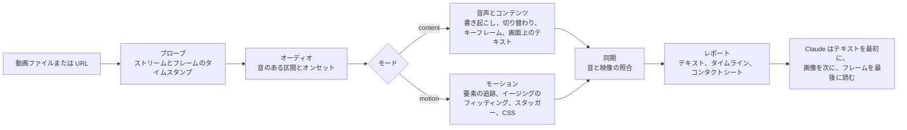

<!-- 言語バー。実在する README ファイルだけを載せます。翻訳者は下のマーカーの前に、同じ形式で自分の言語のリンクを追加してください。
     例：· <a href="README.ja.md">日本語</a> -->
<p align="center">
  <a href="README.md">English</a> · <a href="README.ko.md">한국어</a> · <b>日本語</b> · <a href="README.zh-CN.md">简体中文</a> · <a href="README.zh-TW.md">繁體中文</a> · <a href="README.es.md">Español</a> · <a href="README.pt-BR.md">Português (Brasil)</a> · <a href="README.de.md">Deutsch</a> · <a href="README.fr.md">Français</a>
  <!-- i18n:languages -->
</p>

# video-lens

[](LICENSE)
[](#動作要件)
[](#インストール)

動画を目分量で眺めるのではなく計測する Claude Code スキルです。UI アニメーションのタイミングとイージングを CSS として、シーン、画面上のテキスト、音声をタイムスタンプ付きで取り出します。処理はすべてお使いの Mac 上で行われます。

インタラクティブなグラフ付きの Web サイト：<https://junhan2.github.io/video-lens/>

## 目次

- [なぜ必要か](#なぜ必要か)
- [使いどころ](#使いどころ)
- [インストール](#インストール)
- [使い方](#使い方)
- [仕組み](#仕組み)
- [ベンチマークの概要](#ベンチマークの概要)
- [制限事項](#制限事項)
- [コントリビュートとセルフテスト](#コントリビュートとセルフテスト)
- [ライセンス](#ライセンス)

## なぜ必要か

Claude は動画を見ることができません。video-lens は動画をフレーム単位で計測し、まず数値とテキストを Claude に渡し、目で確かめる必要がある箇所だけ画像を見せます。

- **UI モーション：** アニメーションする各要素の開始時刻、継続時間、イージング（名前付きカーブまたは cubic-bezier）、スタッガー、移動距離をフレーム単位で求め、CSS として書き出します。
- **講演やデモ：** シーンの切り替わり、キーフレーム、画面上の韓国語と英語のテキスト（macOS Vision）、音声の書き起こし、音声と映像の同期を、すべてタイムスタンプ付きで取り出します。
- **アップロードなし：** ffmpeg、OpenCV、macOS Vision、Apple のオンデバイス音声認識、whisper.cpp を使います。

### /watch や video-use との比較

| | /watch (claude-video 0.1.3) | video-use (browser-use) | video-lens |
|---|---|---|---|
| 見るフレーム | 最大で毎秒 2 枚、合計 100 枚 | 要求した範囲ごとに 10 枚、幅 320 px（要求したときのみ） | 全フレーム |
| 時間の精度 | 秒単位 | 音声は単語ごとのタイムスタンプ、フレームは要求した時刻のもの | 1 フレーム（60 fps で 16.7 ms） |
| 300 ms のアニメーション | 0 枚または 1 枚 | 抽出したフレームのみ。動きは計測しない | 開始時刻、継続時間、イージング、CSS を計測 |
| 音声 | 英語字幕がなければ、音声を Groq または OpenAI Whisper にアップロード | 音声を ElevenLabs Scribe にアップロード（有料の API キーが必要） | Mac 上で書き起こし（韓国語にも対応） |
| シーンの切り替わりと画面上のテキスト | 検出しない | 検出しない | 切り替わりの時刻と各スライドのテキスト |

/watch は、動画がどんな内容かを手早く把握するためのものです。video-use は会話を通じて動画を編集します（カット、色、字幕）。video-lens は、何かが「いつ」「どれだけの時間」「どのように」起きるかを知るためのものです。ベンチマークでは、Opus は /watch や video-use を使ったときのほうが、video-lens を使ったときより平均スコアがわずかに高くなりました。主な理由は、スキルに加えて自前の ffmpeg や OpenCV のコードでクリップを直接計測したことです。また、コストは video-lens を使ったときの 2 倍を上回りました。詳細：[ほかの動画スキルとの比較](#ほかの動画スキルとの比較)。

例：ヘッドレス Chrome で実際の CSS からレンダリングした 3 秒のトースト録画。video-lens の計測結果は 298 ms（範囲 284〜313）と `cubic-bezier(0.22, 1, 0.36, 1)` で、CSS に書かれていたのは 300 ms と同じカーブでした。

### モデル単体との比較

スキルがないと、Claude は動画ごとに ffmpeg と Python のコードを新しく書き、それで計測します。多くの場合はうまくいきますが、コードは実行のたびに変わります。正解データで採点する 9 個のタスクをそれぞれ 3 回、つまり条件ごとに 27 回、video-lens なしと video-lens ありの両方で実行しました。数値は [ベンチマークの概要](#ベンチマークの概要) にあります。

<picture>
  <source media="(prefers-color-scheme: dark)" srcset="docs/assets/charts/cost-dark.png">
  
</picture>

<picture>
  <source media="(prefers-color-scheme: dark)" srcset="docs/assets/charts/time-dark.png">
  
</picture>

<picture>
  <source media="(prefers-color-scheme: dark)" srcset="docs/assets/charts/accuracy-dark.png">
  
</picture>

## 使いどころ

向いている用途：

- **UI モーションの再現やレビュー。** 開始時刻、継続時間、イージング、スタッガーを、それぞれが取りうる範囲とともに数値と CSS で示します。「このトランジションは本当に 400 ms の ease-out？」のような質問に、計測に基づいて答えられます。
- **長い録画。** <!-- long-lecture:start -->10 分の韓国語講義では、Claude Opus 5.5 で video-lens を使うとコストが 30% 減、時間が 74% 減でした（3 回実行の中央値）。<!-- long-lecture:end -->
- **繰り返しのモーション。** カルーセルやループはひとまとまりとして 1 回で計測し、繰り返しごとの開始時刻も示します。
- **非公開の講演や会議。** 音声は Mac 上で書き起こし、スライドのテキストはタイムスタンプ付きで得られます。

不要なケース：

- **短いクリップの大まかな要約。** モデル単体で対応でき、スキルを読み込むとコストが少し増えます。
- **Windows や Linux。** video-lens は macOS 専用です。
- **話者の識別、言語の判定、音楽のテンポ。** これらには対応していません。

## インストール

Claude Code で：

```
/plugin marketplace add Junhan2/video-lens
/plugin install video-lens@video-lens
```

ターミナルで：

```
brew install ffmpeg
python3 -m pip install opencv-python numpy
xcode-select --install   # 画面上のテキスト認識と音声認識のヘルパーをビルドします
```

### 動作要件

| | 項目 | 備考 |
|---|---|---|
| 必須 | macOS | macOS 26（Apple Silicon）で動作を確認しています。 |
| 必須 | ffmpeg | |
| 必須 | opencv-python と numpy を入れた Python 3.10 以降 | Python 3.13、OpenCV 4.12、numpy 2.2 で動作を確認しています。pip が `externally-managed-environment` で拒否する場合(Homebrew の Python)は `--user --break-system-packages` を付けてください。パッケージが足りないときや Python が古いときは、直し方がそのまま表示されます。 |
| 必須 | Xcode Command Line Tools | 画面上のテキスト認識と音声認識のヘルパーをビルドします。 |
| 任意 | macOS 26 | オンデバイス音声認識（Apple SpeechTranscriber）。 |
| 任意 | whisper-cpp と ggml モデル | 例：`~/.local/share/whisper/` に置いた `ggml-large-v3-turbo-q5_0.bin`。whisper で書き起こす場合に使います。 |
| 任意 | Node 24 と Google Chrome | Web ページで宣言された CSS アニメーションを読み取り、計測結果と比べます。 |
| 任意 | yt-dlp | URL から動画を解析します。 |

## 使い方

いつもどおりに質問してください。計測が必要な質問なら、Claude がスキルを選びます。直接呼び出すには、メッセージを `/video-lens` で始めます。

```
この画面録画のアニメーションを CSS で再現できるように分析してください
この講義で各スライドがいつ表示され、何が書かれているかを一覧にしてください
12:00 ごろに何と言っていましたか？
この YouTube のトークを、スクリーンショット付きでシーンごとに要約してください
```

プロンプトでスキル名を指定しないテストでは、Opus 5.5 は 9 タスク中 8 タスクで自らスキルを選びました。

複数の要素が同時に動く場合は、「左側のリストだけ」のように範囲を指定してください。Claude が `--roi` で計測範囲を絞り込みます。

### シーンダイジェスト（依頼したときだけ）

スクリーンショット付きでシーンごとの要約を依頼すると、Claude は `digest.md` と、単体で完結した `digest.html` を作ります。中身は、シーンごとのキャプチャ 1 枚、何が起きているかを 1〜2 行で書いた説明、話された内容、その場面へのリンクです。チャプターのある YouTube 動画はチャプターごとに分けます。21 チャプターある 66 分の韓国語の講演では、Mac 上で約 4 分かかりました（ダウンロード、解析、ダイジェスト作成を含む）。通常の解析でダイジェストが作られることはありません。

## 仕組み

`vl.py analyze` という 1 つのコマンドで動画を計測し、最大 6,000 文字のテキストレポートを出力します。Claude はまずこれを読み、次にラベル付きの画像を数枚見て、個別のフレームは必要なときだけ見ます。



- **モード：** 音のない 2 分以下のクリップはモーションとして、それより長いクリップはコンテンツとして計測し、音のある短いクリップは両方で計測します。
- **音声の取得順：** 字幕ストリーム、次に動画の横に置いた `.srt` または `.vtt`（サイドカーファイル）、次にオンデバイスの Apple SpeechTranscriber、最後に whisper.cpp。音声がアップロードされることはありません。
- **モーション：** OpenCV が動く要素を見つけ、フレームごとに追跡します。開始時刻、継続時間、イージング、スタッガー、移動距離をフィッティングし、範囲と僅差の候補もあわせて報告します。

## ベンチマークの概要

<!-- results:start -->
<!-- Generated from docs/data/benchmark.json by tools/render_results.py. Do not edit by hand. -->

| モデル | 条件 | 平均スコア | 最低スコア | スコア 1.0 の回数 | 1 回あたりの平均コスト | 1 回あたりの平均時間 | 平均ターン数 |
| --- | --- | ---: | ---: | ---: | ---: | ---: | ---: |
| Claude Opus 5.5 | モデル単体 | 0.949 | 0.167 | 21/27 | $0.859 | 420.2 s | 17.5 |
| Claude Opus 5.5 | video-lens 使用 | 0.956 | 0.800 | 15/27 | $0.663 | 265.1 s | 10.1 |
| Claude Sonnet 5.5 | モデル単体 | 0.970 | 0.600 | 22/27 | $0.626 | 287.9 s | 20.9 |
| Claude Sonnet 5.5 | video-lens 使用 | 0.940 | 0.625 | 15/27 | $0.408 | 121.8 s | 10.0 |
| Grok 4.7 | モデル単体 | 0.819 | 0.000 | 14/27 | $0.444 | 785.0 s | 23.3 |
| Grok 4.7 | video-lens 使用 | 0.942 | 0.667 | 14/27 | $0.324 | 1055.9 s | 17.7 |

- Claude Opus 5.5 で video-lens を使用：コスト 23% 減、時間 37% 減。
- Claude Sonnet 5.5 で video-lens を使用：コスト 35% 減、時間 58% 減。
- Grok 4.7 で video-lens を使用：コスト 27% 減、時間 35% 増。

2026-09-29から2026-10-01にかけて計測しました。9 タスク × 3 回 = 条件ごとに 27 回、MCP サーバーなし、一度に 1 回ずつ実行。平均スコア、コスト、時間、ターン数はすべての実行の平均で、最低スコアは 1 回の実行で最も低かったスコアです。

- Claude Opus 5.5：Claude Code で実行、effort high。コストは Claude Code が報告する API 換算の `total_cost_usd` です。時間は Claude Code が報告する実行時間です。
- Claude Sonnet 5.5：Claude Code で実行、effort high。コストは Claude Code が報告する API 換算の `total_cost_usd` です。時間は Claude Code が報告する実行時間です。
- Grok 4.7：Grok Build CLI で実行、effort xhigh。コストは Grok Build CLI が報告する API 換算の `total_cost_usd` です。時間は、実行の開始から終了までに実際にかかった経過時間です。

<!-- results:end -->

video-lens を使った Grok 4.7 の時間はおおまかな値です。計測の途中の一部の期間、これらの実行は同じ Mac でほかの重い処理と並行しており、そのうち 1 回は 4.3 時間かかりました。時間の中央値は、単体の 778 s に対して 446 s でした。

<picture>
  <source media="(prefers-color-scheme: dark)" srcset="docs/assets/charts/tasks-dark.png">
  
</picture>

### ほかの動画スキルとの比較

<!-- skills:start -->
<!-- Generated from docs/data/benchmark.json by tools/render_results.py. Do not edit by hand. -->

Claude Opus 5.5 に各動画スキルを組み合わせ、同じ 9 個のタスクとプロンプトで、条件ごとに 27 回、一度に 1 回ずつ実行しました。どの実行でもプロンプトで使うスキルを指定し、ほかのスキルの実行からは video-lens が見えないようにしました。

| 条件 | 平均スコア | 最低スコア | スコア 1.0 の回数 | 1 回あたりの平均コスト | 1 回あたりの平均時間 | 平均ターン数 | 独自の分析コードを使った回数 |
| --- | ---: | ---: | ---: | ---: | ---: | ---: | ---: |
| モデル単体 | 0.949 | 0.167 | 21/27 | $0.859 | 420.2 s | 17.5 | 26/27 |
| video-lens 使用 | 0.956 | 0.800 | 15/27 | $0.663 | 265.1 s | 10.1 | 2/27 |
| /watch 使用 | 0.984 | 0.800 | 23/27 | $1.773 | 590.0 s | 34.7 | 24/27 |
| video-use 使用 | 0.969 | 0.467 | 23/27 | $1.569 | 487.2 s | 22.1 | 27/27 |

- /watch（claude-video 0.1.3）は毎秒最大 2 フレームを見て、音声を Groq または OpenAI Whisper の API に送ります。
- video-use（browser-use/video-use b877063）は動画を計測するためではなく、編集するために作られています。音声は ElevenLabs Scribe に送り、フレームを並べたフィルムストリップを見ます。今回のタスクで試しているのは、動画をどれだけうまく読み取れるかだけです。
- 独自の分析コード：Opus がスキルのツールとは別に、ffmpeg、OpenCV、whisper のコマンドを自分で書いて実行した回です。/watch と video-use の実行の大半がこれにあたり、増えたコストと時間はここに費やされました。video-lens では、たいていスキルの計測結果だけで足りました。
- コストには、Claude Code がモデルについて報告する金額だけを数えています。/watch（Groq または OpenAI）と video-use（ElevenLabs）が呼び出す音声 API は、それぞれのキーに課金されるため含まれていません。

<!-- skills:end -->

正解データは、ヘッドレス Chrome で実際の CSS アニメーションをフレームごとにレンダリングしたもの（書かれた CSS がそのまま正解）と、macOS の読み上げ機能でナレーションを付けた講義から作りました。カルーセルのタスクは実際の録画で、正解は近似値です。許容誤差は、開始時刻と継続時間が ±1 フレーム、イージングが真のカーブとの差 0.05 以内、音が ±10 ms、発話のタイミングが ±150 ms です。

方法、タスク別の結果、注意点：[docs/BENCHMARK.md](docs/BENCHMARK.md)。スクリプトと生の結果：[bench/](bench/README.md)。

## 制限事項

- 複数の要素が同時に動くと、最初の解析で 1 つの枠にまとめられたり、断片に分かれたりすることがあります。`--roi` で範囲を絞れば解消します。ベンチマークでは Opus 5.5 は自分でこれを行いましたが、Sonnet 5.5 はこれを行う回数がそれより少なめでした。
- 写真やグラデーションの背景上の動き、雑音の多い実環境の音声は、まだ十分にテストされていません。
- 話者の識別、言語の自動判定、音楽のテンポには対応していません。
- 30 fps の録画では時間の分解能が半分になります。できれば 60 fps で録画してください。
- macOS 専用で、macOS 26（Apple Silicon）で動作を確認しています。

## コントリビュートとセルフテスト

- **セルフテスト：** `python3 skills/video-lens/scripts/vl.py selftest` は、合成クリップで正解のわかっているチェックを実行し、1 つでも失敗すると終了コード 1 で終わります。`--quick` はより短いセットを実行します。
- **ベンチマークの数値** は [`docs/data/benchmark.json`](docs/data/benchmark.json) という 1 つのファイルにまとまっています。各モデルには `settings` ブロック（実行環境、effort、コストと時間の取り方）があり、モデルごとの設定の行はここから作られます。このファイルを変更したら、`python3 tools/render_results.py`（すべての README と BENCHMARK ファイルにある `results`、`per-task`、`tasks`、`long-lecture` の各マーカーの間のテキストと、`docs/index.html` 内の計算された文を書き直します。`--check` は報告だけを行います）と `node tools/render_charts.mjs`（ヘッドレス Chrome でグラフ画像を描き直します）を実行してください。
- **翻訳：** `docs/i18n/en.json` を `docs/i18n/<lang>.json` にコピーして値を翻訳し、`docs/i18n/languages.json` に言語を追加してから `python3 tools/i18n.py check` を実行します。README を翻訳する場合は、同じマーカーを入れた `README.<lang>.md` を作成して `python3 tools/render_results.py` を実行すると、表がその言語のラベルで表示されます。`en.json` や `languages.json` を編集したあとは、`python3 tools/i18n.py sync` と `python3 tools/render_results.py` を実行して、ページに埋め込まれた英語と言語リンクをそろえてください。

## ライセンス

[MIT](LICENSE)
