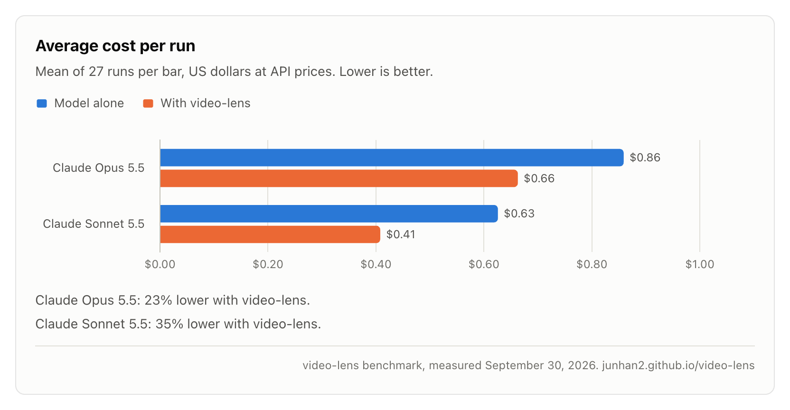
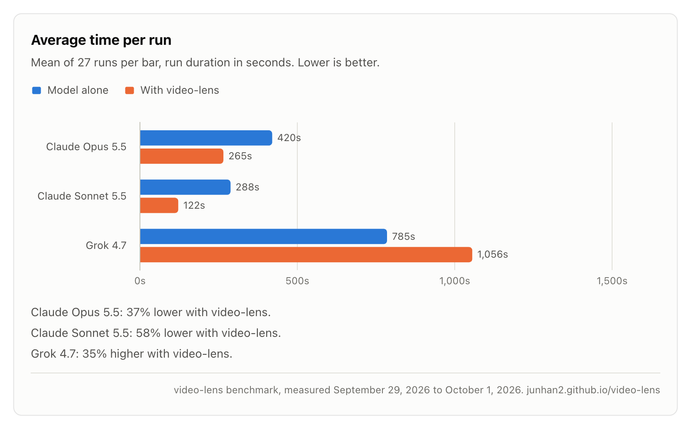
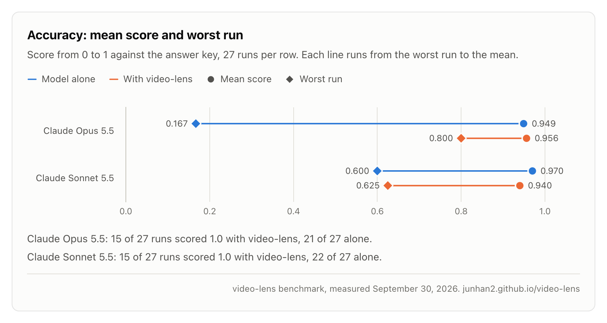
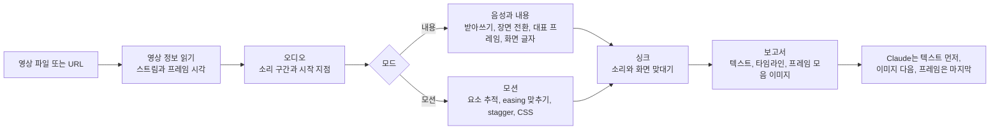
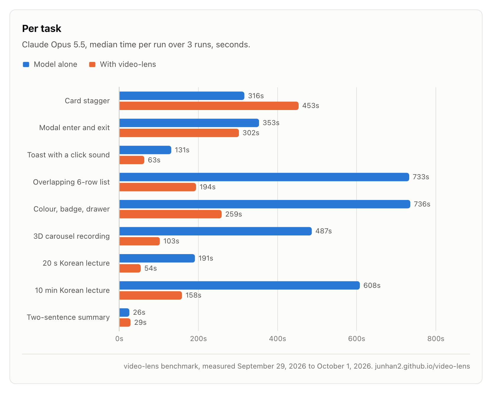

<!-- 언어 표시줄. 실제로 있는 README 파일만 적습니다. 번역자는 아래 표시 바로 앞에 같은 형식으로 링크를 더합니다.
     예: · <a href="README.ja.md">日本語</a> -->
<p align="center">
  <a href="README.md">English</a> · <b>한국어</b> · <a href="README.ja.md">日本語</a> · <a href="README.zh-CN.md">简体中文</a> · <a href="README.zh-TW.md">繁體中文</a> · <a href="README.es.md">Español</a> · <a href="README.pt-BR.md">Português (Brasil)</a> · <a href="README.de.md">Deutsch</a> · <a href="README.fr.md">Français</a>
  <!-- i18n:languages -->
</p>

# video-lens

[](LICENSE)
[](#요구-사항)
[](#설치)

영상을 눈대중으로 보지 않고 재는 Claude Code 스킬입니다. UI 애니메이션의 타이밍과 easing은 CSS로, 장면, 화면 글자, 음성은 시각과 함께 알려 줍니다. 모든 처리는 내 Mac에서 합니다.

그래프를 직접 조작해 볼 수 있는 웹사이트: <https://junhan2.github.io/video-lens/>

## 목차

- [왜 필요한가](#왜-필요한가)
- [언제 쓰나](#언제-쓰나)
- [설치](#설치)
- [쓰는 법](#쓰는-법)
- [동작 방식](#동작-방식)
- [벤치마크 요약](#벤치마크-요약)
- [한계](#한계)
- [기여와 자체 점검](#기여와-자체-점검)
- [라이선스](#라이선스)

## 왜 필요한가

Claude는 영상을 직접 보지 못합니다. video-lens는 영상을 프레임 단위로 재서 숫자와 글을 먼저 Claude에게 건네고, 눈으로 봐야 할 곳만 이미지로 보여 줍니다.

- **UI 모션:** 움직이는 요소마다 시작, 지속 시간, easing(이름 있는 곡선 또는 cubic-bezier), stagger(요소 사이 시차), 이동 거리를 프레임 단위로 재서 CSS로 적어 줍니다.
- **강연과 데모:** 장면 전환, 대표 프레임, 한국어와 영어 화면 글자(macOS Vision), 음성 받아쓰기, 소리와 화면의 싱크를 모두 시각과 함께 정리합니다.
- **업로드 없음:** ffmpeg, OpenCV, macOS Vision, Apple 기기 내 음성 인식, whisper.cpp로 처리합니다.

### /watch, video-use와 비교

| | /watch (claude-video 0.1.3) | video-use (browser-use) | video-lens |
|---|---|---|---|
| 보는 프레임 | 초당 최대 2장, 전체 100장 | 요청한 구간마다 10장(가로 320 px), 요청할 때만 | 모든 프레임 |
| 시간 정밀도 | 초 단위 | 음성은 단어마다 시각이 붙음, 프레임은 요청한 시각에서만 | 한 프레임(60 fps에서 16.7 ms) |
| 300 ms 애니메이션 | 0장 또는 1장 | 뽑은 프레임만 봄, 움직임은 재지 않음 | 시작, 지속 시간, easing, CSS를 측정 |
| 음성 | 영어 자막이 없으면 오디오를 Groq 또는 OpenAI Whisper로 업로드 | 오디오를 ElevenLabs Scribe로 업로드(유료 API 키) | 내 Mac에서 받아쓰기, 한국어 포함 |
| 장면 전환과 화면 글자 | 감지 안 함 | 감지 안 함 | 전환 시각과 슬라이드별 글자 |

/watch는 영상이 무슨 내용인지 빠르게 훑어보는 데 맞춰져 있습니다. video-use는 대화로 영상을 편집합니다. 컷, 색 보정, 자막을 다룹니다. video-lens는 어떤 일이 언제, 얼마 동안, 어떻게 일어나는지 알아야 할 때 씁니다. 벤치마크에서 Opus는 /watch나 video-use를 쓸 때 video-lens를 쓸 때보다 평균 점수가 조금 높았습니다. 주된 이유는 스킬에 더해 자기가 짠 ffmpeg와 OpenCV 코드로 영상을 직접 쟀기 때문이고, 비용은 video-lens를 쓸 때의 두 배가 넘었습니다. 자세한 내용: [다른 영상 스킬과 비교](#다른-영상-스킬과-비교).

예: headless Chrome(화면 없이 돌리는 Chrome)에서 실제 CSS로 렌더링한 3초짜리 토스트(잠깐 떴다 사라지는 알림) 녹화가 있습니다. video-lens는 298 ms(범위 284~313)와 `cubic-bezier(0.22, 1, 0.36, 1)`로 쟀습니다. CSS에 적힌 값은 300 ms와 같은 곡선이었습니다.

### 모델만 쓸 때와 비교

스킬이 없으면 Claude는 영상마다 ffmpeg와 Python 코드를 새로 짜서 잽니다. 잘 될 때가 많지만, 코드가 실행할 때마다 달라집니다. 정답표로 채점하는 과제 9개를 과제마다 3회씩, 즉 조건마다 27회를 video-lens 없이, 그리고 video-lens와 함께 돌렸습니다. 숫자는 [벤치마크 요약](#벤치마크-요약)에 있습니다.

<picture>
  <source media="(prefers-color-scheme: dark)" srcset="docs/assets/charts/cost-dark.png">
  
</picture>

<picture>
  <source media="(prefers-color-scheme: dark)" srcset="docs/assets/charts/time-dark.png">
  
</picture>

<picture>
  <source media="(prefers-color-scheme: dark)" srcset="docs/assets/charts/accuracy-dark.png">
  
</picture>

## 언제 쓰나

쓰면 좋은 경우:

- **UI 모션을 다시 만들거나 검토할 때.** 시작, 지속 시간, easing, stagger를 숫자와 CSS로 주고, 값마다 들어갈 수 있는 범위도 함께 줍니다. "이 전환이 정말 400 ms ease-out인가?" 같은 질문에 잰 값으로 답합니다.
- **긴 녹화.** <!-- long-lecture:start -->10분짜리 한국어 강의에서 Claude Opus 5.5에 video-lens를 쓰면 비용 30% 감소, 시간 74% 감소(실행 3회의 중앙값).<!-- long-lecture:end -->
- **반복되는 모션.** 캐러셀과 반복 애니메이션은 한 묶음으로 한 번에 재고, 반복마다 시작 시각을 알려 줍니다.
- **비공개 강연과 회의.** 음성은 내 Mac에서 받아쓰고, 슬라이드 글자는 시각과 함께 나옵니다.

필요 없는 경우:

- **짧은 영상의 대략적인 요약.** 모델만으로 충분하고, 스킬을 불러오면 비용이 조금 늘어납니다.
- **Windows나 Linux.** video-lens는 macOS에서만 돌아갑니다.
- **화자 구분, 언어 감지, 음악 템포.** 지원하지 않습니다.

## 설치

Claude Code에서:

```
/plugin marketplace add Junhan2/video-lens
/plugin install video-lens@video-lens
```

터미널에서:

```
brew install ffmpeg
pip3 install opencv-python numpy
xcode-select --install   # 화면 글자와 음성 인식 보조 프로그램을 빌드합니다
```

### 요구 사항

| | 항목 | 참고 |
|---|---|---|
| 필수 | macOS | macOS 26, Apple Silicon에서 시험했습니다. |
| 필수 | ffmpeg | |
| 필수 | opencv-python과 numpy가 설치된 Python 3 | Python 3.13에서 시험했습니다. 패키지가 없으면 실행할 pip 명령을 그대로 알려 줍니다. |
| 필수 | Xcode Command Line Tools | 화면 글자와 음성 인식 보조 프로그램을 빌드합니다. |
| 선택 | macOS 26 | 기기 내 음성 인식(Apple SpeechTranscriber). |
| 선택 | whisper-cpp와 ggml 모델 | 예: `~/.local/share/whisper/`에 둔 `ggml-large-v3-turbo-q5_0.bin`. whisper로 받아쓸 때 씁니다. |
| 선택 | Node 24와 Google Chrome | 웹페이지에 선언된 CSS 애니메이션을 읽어 측정값과 비교합니다. |
| 선택 | yt-dlp | URL로 영상을 분석합니다. |

## 쓰는 법

평소처럼 물어보면 됩니다. 재야 하는 질문이면 Claude가 스킬을 고릅니다. 직접 부르려면 메시지를 `/video-lens`로 시작하세요.

```
이 화면 녹화의 애니메이션을 CSS로 다시 만들 수 있게 분석해 줘
이 강의에서 슬라이드가 언제 나오고 무슨 내용인지 정리해 줘
12:00 무렵에 무슨 말을 했어?
이 YouTube 강연을 장면별로 스크린샷과 함께 요약해 줘
```

프롬프트에 스킬 이름을 넣지 않은 시험에서 Opus 5.5는 과제 9개 중 8개에서 스스로 스킬을 골랐습니다.

여러 요소가 한꺼번에 움직이면 "왼쪽 목록만"처럼 볼 영역을 알려 주세요. 그러면 Claude가 `--roi`로 측정 범위를 좁힙니다.

### 장면 요약, 요청할 때만

스크린샷을 곁들인 장면별 요약을 요청하면 Claude가 `digest.md`와 파일 하나로 열리는 `digest.html`을 만듭니다. 장면마다 캡처 한 장, 무슨 일이 일어나는지 한두 줄, 나온 말, 그 순간으로 가는 링크가 들어갑니다. 챕터가 있는 YouTube 영상은 챕터대로 나눕니다. 챕터 21개짜리 66분 한국어 강연에서는 Mac에서 약 4분이 걸렸습니다(내려받기, 분석, 요약 포함). 일반 분석에서는 이 요약을 만들지 않습니다.

## 동작 방식

명령 하나, `vl.py analyze`가 영상을 재고 최대 6,000자의 텍스트 보고서를 출력합니다. Claude는 이 보고서를 먼저 읽고, 다음으로 설명이 붙은 이미지 몇 장을 보고, 꼭 필요할 때만 프레임을 한 장씩 봅니다.



- **모드:** 소리 없는 2분 이하 영상은 모션으로, 더 긴 영상은 내용으로 재고, 소리가 있는 짧은 영상은 둘 다 거칩니다.
- **음성을 얻는 순서:** 자막 스트림, 그다음 영상 옆에 둔 `.srt`나 `.vtt` 파일, 그다음 기기 안에서 도는 Apple SpeechTranscriber, 마지막으로 whisper.cpp입니다. 오디오는 절대 업로드하지 않습니다.
- **모션:** OpenCV가 움직이는 요소를 찾아 프레임마다 따라갑니다. 시작, 지속 시간, easing, stagger, 이동 거리를 맞춰 내고, 값의 범위와 거의 비슷하게 맞는 다른 후보도 함께 알려 줍니다.

## 벤치마크 요약

<!-- results:start -->
<!-- Generated from docs/data/benchmark.json by tools/render_results.py. Do not edit by hand. -->

| 모델 | 조건 | 평균 점수 | 최저 점수 | 1.0점 실행 | 실행당 평균 비용 | 실행당 평균 시간 | 평균 턴 수 |
| --- | --- | ---: | ---: | ---: | ---: | ---: | ---: |
| Claude Opus 5.5 | 모델 단독 | 0.949 | 0.167 | 21/27 | $0.859 | 420.2 s | 17.5 |
| Claude Opus 5.5 | video-lens 사용 | 0.956 | 0.800 | 15/27 | $0.663 | 265.1 s | 10.1 |
| Claude Sonnet 5.5 | 모델 단독 | 0.970 | 0.600 | 22/27 | $0.626 | 287.9 s | 20.9 |
| Claude Sonnet 5.5 | video-lens 사용 | 0.940 | 0.625 | 15/27 | $0.408 | 121.8 s | 10.0 |
| Grok 4.7 | 모델 단독 | 0.819 | 0.000 | 14/27 | $0.444 | 785.0 s | 23.3 |
| Grok 4.7 | video-lens 사용 | 0.942 | 0.667 | 14/27 | $0.324 | 1055.9 s | 17.7 |

- Claude Opus 5.5에 video-lens를 쓰면 비용 23% 감소, 시간 37% 감소.
- Claude Sonnet 5.5에 video-lens를 쓰면 비용 35% 감소, 시간 58% 감소.
- Grok 4.7에 video-lens를 쓰면 비용 27% 감소, 시간 35% 증가.

2026-09-29부터 2026-10-01까지 측정했습니다. 과제 9개 × 3회 = 조건마다 27회이며, MCP 서버 없이 한 번에 하나씩 실행했습니다. 평균 점수, 비용, 시간, 턴 수는 모든 실행의 평균이고, 최저 점수는 가장 낮았던 한 번의 점수입니다.

- Claude Opus 5.5: Claude Code에서 실행, effort high. 비용은 Claude Code에서 보고하는 API 환산 금액 `total_cost_usd`입니다. 시간은 Claude Code에서 보고하는 실행 시간입니다.
- Claude Sonnet 5.5: Claude Code에서 실행, effort high. 비용은 Claude Code에서 보고하는 API 환산 금액 `total_cost_usd`입니다. 시간은 Claude Code에서 보고하는 실행 시간입니다.
- Grok 4.7: Grok Build CLI에서 실행, effort xhigh. 비용은 Grok Build CLI에서 보고하는 API 환산 금액 `total_cost_usd`입니다. 시간은 실행 시작부터 끝까지 실제로 걸린 시간입니다.

<!-- results:end -->

video-lens를 쓴 Grok 4.7의 시간은 대략적인 값입니다. 측정 기간 중 일부 동안 이 실행들이 다른 무거운 작업과 같은 Mac을 나눠 썼고, 그중 한 번은 4.3시간이 걸렸습니다. 시간 중앙값은 446 s였고, 모델 단독은 778 s였습니다.

<picture>
  <source media="(prefers-color-scheme: dark)" srcset="docs/assets/charts/tasks-dark.png">
  
</picture>

### 다른 영상 스킬과 비교

<!-- skills:start -->
<!-- Generated from docs/data/benchmark.json by tools/render_results.py. Do not edit by hand. -->

Claude Opus 5.5에 영상 스킬을 하나씩 붙여, 같은 과제 9개와 같은 프롬프트로 조건마다 27회, 한 번에 하나씩 실행했습니다. 실행마다 프롬프트에 해당 스킬 이름을 넣었고, 다른 스킬을 쓰는 실행에서는 video-lens를 숨겼습니다.

| 조건 | 평균 점수 | 최저 점수 | 1.0점 실행 | 실행당 평균 비용 | 실행당 평균 시간 | 평균 턴 수 | 자체 분석 코드를 쓴 실행 |
| --- | ---: | ---: | ---: | ---: | ---: | ---: | ---: |
| 모델 단독 | 0.949 | 0.167 | 21/27 | $0.859 | 420.2 s | 17.5 | 26/27 |
| video-lens 사용 | 0.956 | 0.800 | 15/27 | $0.663 | 265.1 s | 10.1 | 2/27 |
| /watch 사용 | 0.984 | 0.800 | 23/27 | $1.773 | 590.0 s | 34.7 | 24/27 |
| video-use 사용 | 0.969 | 0.467 | 23/27 | $1.569 | 487.2 s | 22.1 | 27/27 |

- /watch(claude-video 0.1.3)는 초당 최대 2프레임을 보고, 음성은 Groq 또는 OpenAI Whisper API로 보냅니다.
- video-use(browser-use/video-use b877063)는 영상을 재는 용도가 아니라 편집하는 용도로 만들어졌습니다. 음성은 ElevenLabs Scribe로 보내고, 프레임을 필름처럼 이어 붙인 이미지를 봅니다. 이 과제들은 영상을 얼마나 잘 읽는지만 시험합니다.
- 자체 분석 코드: Opus가 스킬의 도구 말고도 ffmpeg, OpenCV, whisper 명령을 직접 짜서 돌린 실행입니다. /watch와 video-use 실행은 대부분 그랬고, 늘어난 비용과 시간은 여기서 나왔습니다. video-lens를 쓸 때는 대개 스킬이 잰 값만으로 충분했습니다.
- 비용은 Claude Code가 모델 사용분으로 보고한 금액만 셉니다. /watch(Groq 또는 OpenAI)와 video-use(ElevenLabs)가 부르는 음성 API는 각자의 키로 따로 청구되며, 여기에 포함되지 않습니다.

<!-- skills:end -->

정답표는 headless Chrome에서 실제 CSS 애니메이션을 프레임마다 렌더링해 만들었고(정답은 적힌 CSS 그대로입니다), 강의는 macOS 음성 합성으로 읽은 것입니다. 캐러셀 과제는 실제 녹화라서 정답이 근사값입니다. 허용 오차는 시작과 지속 시간 ±1 프레임, easing은 실제 곡선과 0.05 이내, 소리 ±10 ms, 말의 시각 ±150 ms입니다.

방법, 과제별 결과, 주의할 점: [docs/BENCHMARK.md](docs/BENCHMARK.md). 스크립트와 실행별 원본 결과: [bench/](bench/README.md).

## 한계

- 여러 요소가 한꺼번에 움직이면 첫 분석에서 한 상자로 합쳐지거나 여러 조각으로 나뉠 수 있습니다. `--roi`로 영역을 좁히면 해결됩니다. 벤치마크에서 Opus 5.5는 이 일을 스스로 했고, Sonnet 5.5는 그보다 덜 자주 했습니다.
- 사진이나 그라데이션 배경 위의 모션, 잡음이 많은 실제 음성은 충분히 시험하지 않았습니다.
- 화자 구분, 언어 자동 감지, 음악 템포는 지원하지 않습니다.
- 30 fps 녹화는 시간 해상도가 절반입니다. 가능하면 60 fps로 녹화하세요.
- macOS 전용이며, macOS 26과 Apple Silicon에서 시험했습니다.

## 기여와 자체 점검

- **자체 점검:** `python3 skills/video-lens/scripts/vl.py selftest`는 합성 영상으로 정답을 아는 검사를 돌리고, 하나라도 실패하면 종료 코드 1로 끝납니다. `--quick`은 더 짧은 검사만 돌립니다.
- **벤치마크 숫자**는 [`docs/data/benchmark.json`](docs/data/benchmark.json) 한 파일에 있습니다. 이 파일에는 모델마다 `settings` 블록(실행 도구, effort, 비용과 시간을 얻은 방법)이 있고, 모델별 실행 조건 문장은 여기서 만들어집니다. 파일을 바꾼 뒤에는 `python3 tools/render_results.py`(모든 README와 BENCHMARK 파일에서 `results`, `per-task`, `tasks`, `long-lecture` 표시 사이의 글과 `docs/index.html`의 계산된 문장을 다시 씁니다. `--check`는 확인 결과만 알려 줍니다)와 `node tools/render_charts.mjs`(headless Chrome으로 그래프 이미지를 다시 그립니다)를 실행합니다.
- **번역:** `docs/i18n/en.json`을 `docs/i18n/<lang>.json`으로 복사해 값을 번역하고, `docs/i18n/languages.json`에 언어를 더한 뒤 `python3 tools/i18n.py check`를 실행합니다. 번역한 README는 같은 표시를 넣어 `README.<lang>.md`로 만들고 `python3 tools/render_results.py`를 실행합니다. 그러면 표가 그 언어의 이름표로 채워집니다. `en.json`이나 `languages.json`을 고친 뒤에는 `python3 tools/i18n.py sync`와 `python3 tools/render_results.py`를 실행해 페이지에 내장된 영어와 언어 링크를 맞춥니다.

## 라이선스

[MIT](LICENSE)
