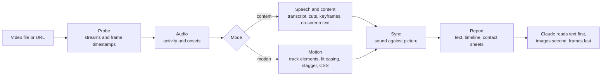

<!-- Language bar. List only README files that exist. Translators: add your link before the marker below,
     in the same form, e.g. · <a href="README.ja.md">日本語</a> -->
<p align="center">
  <b>English</b> · <a href="README.ko.md">한국어</a>
  <!-- i18n:languages -->
</p>

# video-lens

[](LICENSE)
[](#requirements)
[](#install)

A Claude Code skill that measures video instead of eyeballing it: UI animation timing and easing as CSS, and scenes, on-screen text and speech with timestamps. Everything runs on your Mac.

Website with interactive charts: <https://junhan2.github.io/video-lens/>

## Contents

- [Why](#why)
- [When to use it](#when-to-use-it)
- [Install](#install)
- [Usage](#usage)
- [How it works](#how-it-works)
- [Benchmark summary](#benchmark-summary)
- [Limits](#limits)
- [Contributing and self-test](#contributing-and-self-test)
- [License](#license)

## Why

Claude cannot watch video. video-lens measures it frame by frame, hands Claude numbers and text first, and shows images only where a look is needed.

- **UI motion:** start, duration, easing (a named curve or cubic-bezier), stagger and travel of each animated element, to the frame, written out as CSS.
- **Talks and demos:** scene cuts, keyframes, Korean and English on-screen text (macOS Vision), a speech transcript and audio/video sync, all with timestamps.
- **Nothing uploaded:** ffmpeg, OpenCV, macOS Vision, Apple on-device speech recognition and whisper.cpp.

### Compared with /watch and video-use

| | /watch (claude-video 0.1.3) | video-use (browser-use) | video-lens |
|---|---|---|---|
| Frames looked at | At most 2 per second, 100 in total | 10 frames per requested range, 320 px wide, when it asks for them | Every frame |
| Time precision | Whole seconds | Word timestamps for speech; frames at the times it asks for | One frame (16.7 ms at 60 fps) |
| A 300 ms animation | 0 or 1 frames | Only the frames it samples; motion is not measured | Start, duration, easing and CSS measured |
| Speech | Audio uploaded to Groq or OpenAI Whisper unless English captions exist | Audio uploaded to ElevenLabs Scribe (paid API key) | Transcribed on your Mac, Korean included |
| Scene cuts and on-screen text | Not detected | Not detected | Cut times and the text of each slide |

/watch is built for a quick look at what a video is about. video-use edits videos by conversation: cuts, colour and subtitles. video-lens is for when something happens, for how long and how. How the three score on the same tasks: [Against other video skills](#against-other-video-skills).

Example: a 3-second toast recording rendered from real CSS in headless Chrome. video-lens measured 298 ms (range 284 to 313) and `cubic-bezier(0.22, 1, 0.36, 1)`. The CSS said 300 ms and the same curve.

### Compared with the model alone

Without the skill, Claude writes new ffmpeg and Python code for each video and measures with it. That often works, but the code differs every run. We ran 9 tasks scored against answer keys, 3 runs each, so 27 runs per condition, with and without video-lens. The numbers are in [Benchmark summary](#benchmark-summary).

<picture>
  <source media="(prefers-color-scheme: dark)" srcset="docs/assets/charts/cost-dark.png">
  
</picture>

<picture>
  <source media="(prefers-color-scheme: dark)" srcset="docs/assets/charts/time-dark.png">
  
</picture>

<picture>
  <source media="(prefers-color-scheme: dark)" srcset="docs/assets/charts/accuracy-dark.png">
  
</picture>

## When to use it

Use it for:

- **Rebuilding or reviewing UI motion.** Start, duration, easing and stagger as numbers and CSS, each with the range it could fall in. "Is this transition really 400 ms ease-out?" gets a measured answer.
- **Long recordings.** <!-- long-lecture:start -->On the 10-minute Korean lecture, Claude Opus 5.5 with video-lens: cost 30% lower, time 74% lower (median of 3 runs).<!-- long-lecture:end -->
- **Repeated motion.** Carousels and loops are measured once as a group, with each repeat's start time.
- **Private talks and meetings.** Speech is transcribed on your Mac, and slide text comes with timestamps.

You do not need it for:

- **A quick gist of a short clip.** The model alone handles it, and loading the skill adds a little cost.
- **Windows or Linux.** video-lens runs on macOS only.
- **Speaker labels, language detection or music tempo.** These are not supported.

## Install

In Claude Code:

```
/plugin marketplace add Junhan2/video-lens
/plugin install video-lens@video-lens
```

In a terminal:

```
brew install ffmpeg
pip3 install opencv-python numpy
xcode-select --install   # builds the on-screen text and speech helpers
```

### Requirements

| | What | Notes |
|---|---|---|
| Required | macOS | Tested on macOS 26 with Apple Silicon. |
| Required | ffmpeg | |
| Required | Python 3 with opencv-python and numpy | Tested with Python 3.13. A missing package prints the exact pip command. |
| Required | Xcode Command Line Tools | Builds the on-screen text and speech helpers. |
| Optional | macOS 26 | On-device speech recognition (Apple SpeechTranscriber). |
| Optional | whisper-cpp and a ggml model | For example `ggml-large-v3-turbo-q5_0.bin` in `~/.local/share/whisper/`, to transcribe with whisper. |
| Optional | Node 24 and Google Chrome | Reads a web page's declared CSS animations and compares them with the measurement. |
| Optional | yt-dlp | Analyses a video from a URL. |

## Usage

Ask as usual. Claude picks the skill when a question needs measuring. To call it directly, start your message with `/video-lens`.

```
Analyse the animation in this screen recording so I can rebuild it in CSS
List when each slide appears in this lecture and what it says
What was said around 12:00?
```

In a test where the prompt did not name the skill, Opus 5.5 chose it on its own in 8 of 9 tasks.

When several elements move at once, name the area, for example "only the list on the left". Claude then narrows the measurement with `--roi`.

## How it works

One command, `vl.py analyze`, measures the video and prints a text report of at most 6,000 characters. Claude reads that first, then a few labelled images, and single frames only when needed.



- **Mode:** a quiet clip of up to 2 minutes is measured as motion, a longer one as content, and a short clip with sound gets both.
- **Speech order:** a subtitle stream, then a sidecar `.srt` or `.vtt`, then Apple SpeechTranscriber on device, then whisper.cpp. Audio is never uploaded.
- **Motion:** OpenCV finds the moving elements and tracks them frame by frame; start, duration, easing, stagger and travel are fitted, with ranges and near ties reported.

## Benchmark summary

<!-- results:start -->
<!-- Generated from docs/data/benchmark.json by tools/render_results.py. Do not edit by hand. -->

| Model | Condition | Mean score | Worst run | Runs scoring 1.0 | Avg cost per run | Avg time per run | Avg turns |
| --- | --- | ---: | ---: | ---: | ---: | ---: | ---: |
| Claude Opus 5.5 | Model alone | 0.949 | 0.167 | 21/27 | $0.859 | 420.2 s | 17.5 |
| Claude Opus 5.5 | With video-lens | 0.956 | 0.800 | 15/27 | $0.663 | 265.1 s | 10.1 |
| Claude Sonnet 5.5 | Model alone | 0.970 | 0.600 | 22/27 | $0.626 | 287.9 s | 20.9 |
| Claude Sonnet 5.5 | With video-lens | 0.940 | 0.625 | 15/27 | $0.408 | 121.8 s | 10.0 |

- Claude Opus 5.5 with video-lens: cost 23% lower, time 37% lower.
- Claude Sonnet 5.5 with video-lens: cost 35% lower, time 58% lower.

Measured 2026-09-30. 9 tasks × 3 runs = 27 runs per condition, no MCP servers, one run at a time. Mean score, cost, time and turns are means over all runs; the worst run is the lowest single score.

- Claude Opus 5.5: run in Claude Code, effort high. Cost is the API-equivalent `total_cost_usd` that Claude Code reports. Time is the run duration that Claude Code reports.
- Claude Sonnet 5.5: run in Claude Code, effort high. Cost is the API-equivalent `total_cost_usd` that Claude Code reports. Time is the run duration that Claude Code reports.

<!-- results:end -->

<picture>
  <source media="(prefers-color-scheme: dark)" srcset="docs/assets/charts/tasks-dark.png">
  
</picture>

### Against other video skills

<!-- skills:start -->
<!-- Generated from docs/data/benchmark.json by tools/render_results.py. Do not edit by hand. -->

Runs in progress. The results appear here when every run has finished.

<!-- skills:end -->

Answer keys come from real CSS animations rendered frame by frame in headless Chrome (the truth is the CSS as written) and from lectures narrated with macOS text-to-speech; the carousel task is a real recording with an approximate key. Tolerances: start and duration ±1 frame, easing within 0.05 of the true curve, sounds ±10 ms, speech timing ±150 ms.

Method, per-task results and caveats: [docs/BENCHMARK.md](docs/BENCHMARK.md). Scripts and raw results: [bench/](bench/README.md).

## Limits

- Several elements moving at once can come out merged into one box or split into fragments in the first pass. Narrowing the area with `--roi` fixes it. In the benchmark Opus 5.5 did this on its own; Sonnet 5.5 did it less often.
- Motion over photo or gradient backgrounds and noisy real-world speech are under-tested.
- No speaker labels, language auto-detection or music tempo.
- 30 fps recordings halve the timing resolution. Record at 60 fps when you can.
- macOS only, tested on macOS 26 with Apple Silicon.

## Contributing and self-test

- **Self-test:** `python3 skills/video-lens/scripts/vl.py selftest` runs known-answer checks on synthetic clips and exits 1 on any failure. `--quick` runs a shorter set.
- **Benchmark numbers** live in one file, [`docs/data/benchmark.json`](docs/data/benchmark.json). Each model there has a `settings` block (harness, effort, how cost and time were taken) that the per-model setup lines are built from. After changing the file, run `python3 tools/render_results.py` (rewrites the text between the `results`, `per-task`, `tasks` and `long-lecture` markers in every README and BENCHMARK file, and the computed sentences in `docs/index.html`; `--check` only reports) and `node tools/render_charts.mjs` (re-renders the chart images with headless Chrome).
- **Translations:** copy `docs/i18n/en.json` to `docs/i18n/<lang>.json`, translate the values, add the language to `docs/i18n/languages.json`, and run `python3 tools/i18n.py check`. For a translated README, create `README.<lang>.md` with the same markers and run `python3 tools/render_results.py`; its tables then use your labels. After editing `en.json` or `languages.json`, run `python3 tools/i18n.py sync` and `python3 tools/render_results.py` so the page's built-in English and its language links match.

## License

[MIT](LICENSE)
