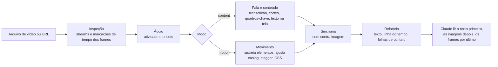

<!-- Barra de idiomas. Liste apenas os arquivos README que existem. Tradutores: acrescentem seu link antes do marcador abaixo,
     no mesmo formato, por exemplo · <a href="README.ja.md">日本語</a> -->
<p align="center">
  <a href="README.md">English</a> · <a href="README.ko.md">한국어</a> · <a href="README.ja.md">日本語</a> · <a href="README.zh-CN.md">简体中文</a> · <a href="README.zh-TW.md">繁體中文</a> · <a href="README.es.md">Español</a> · <b>Português (Brasil)</b> · <a href="README.de.md">Deutsch</a> · <a href="README.fr.md">Français</a>
  <!-- i18n:languages -->
</p>

# video-lens

[](LICENSE)
[](#requisitos)
[](#instalação)

Uma skill do Claude Code que mede vídeos em vez de avaliá-los a olho: tempo e easing de animações de interface em CSS, além de cenas, texto na tela e fala com marcações de tempo. Tudo roda no seu Mac.

Site com gráficos interativos: <https://junhan2.github.io/video-lens/>

## Sumário

- [Por que usar](#por-que-usar)
- [Quando usar](#quando-usar)
- [Instalação](#instalação)
- [Uso](#uso)
- [Como funciona](#como-funciona)
- [Resumo do benchmark](#resumo-do-benchmark)
- [Limitações](#limitações)
- [Contribuição e autoteste](#contribuição-e-autoteste)
- [Licença](#licença)

## Por que usar

O Claude não consegue assistir a vídeos. O video-lens mede o vídeo frame a frame, entrega primeiro números e texto ao Claude e só mostra imagens onde é preciso olhar.

- **Movimento de interface:** início, duração, easing (uma curva nomeada ou cubic-bezier), escalonamento (stagger) e deslocamento de cada elemento animado, com precisão de frame, escritos em CSS.
- **Palestras e demos:** cortes de cena, quadros-chave, texto na tela em coreano e inglês (macOS Vision), transcrição da fala e sincronia entre áudio e vídeo, tudo com marcações de tempo.
- **Nada é enviado:** ffmpeg, OpenCV, macOS Vision, reconhecimento de fala no próprio dispositivo da Apple e whisper.cpp.

### Comparação com /watch e video-use

| | /watch (claude-video 0.1.3) | video-use (browser-use) | video-lens |
|---|---|---|---|
| Frames analisados | No máximo 2 por segundo, 100 no total | 10 frames por intervalo solicitado, com 320 px de largura, quando ele os pede | Todos os frames |
| Precisão de tempo | Segundos inteiros | Marcações de tempo por palavra na fala; frames nos momentos que ele pede | Um frame (16,7 ms a 60 fps) |
| Uma animação de 300 ms | 0 ou 1 frame | Só os frames que ele amostra; o movimento não é medido | Início, duração, easing e CSS medidos |
| Fala | Áudio enviado ao Groq ou ao OpenAI Whisper, a menos que existam legendas em inglês | Áudio enviado ao ElevenLabs Scribe (chave de API paga) | Transcrita no seu Mac, inclusive em coreano |
| Cortes de cena e texto na tela | Não detecta | Não detecta | Momentos dos cortes e o texto de cada slide |

O /watch foi feito para uma olhada rápida no assunto de um vídeo. O video-use edita vídeos por conversa: cortes, cor e legendas. O video-lens serve para saber quando algo acontece, por quanto tempo e como. No benchmark, o Opus com /watch ou video-use teve uma nota média um pouco maior do que com o video-lens, principalmente porque mediu o próprio clipe com seu próprio código em ffmpeg e OpenCV além da skill, e custou mais que o dobro. Detalhes: [Comparação com outras skills de vídeo](#comparação-com-outras-skills-de-vídeo).

Exemplo: a gravação de 3 segundos de um toast renderizado a partir de CSS real no Chrome headless. O video-lens mediu 298 ms (faixa de 284 a 313) e `cubic-bezier(0.22, 1, 0.36, 1)`. O CSS dizia 300 ms e a mesma curva.

### Comparação com o modelo sozinho

Sem a skill, o Claude escreve código novo em ffmpeg e Python para cada vídeo e mede com ele. Muitas vezes funciona, mas o código muda a cada execução. Rodamos 9 tarefas avaliadas com gabarito, 3 execuções cada, ou seja, 27 execuções por condição, com e sem o video-lens. Os números estão em [Resumo do benchmark](#resumo-do-benchmark).

<picture>
  <source media="(prefers-color-scheme: dark)" srcset="docs/assets/charts/cost-dark.png">
  
</picture>

<picture>
  <source media="(prefers-color-scheme: dark)" srcset="docs/assets/charts/time-dark.png">
  
</picture>

<picture>
  <source media="(prefers-color-scheme: dark)" srcset="docs/assets/charts/accuracy-dark.png">
  
</picture>

## Quando usar

Use para:

- **Recriar ou revisar movimento de interface.** Início, duração, easing e stagger como números e CSS, cada um com a faixa em que pode estar. "Esta transição é mesmo 400 ms ease-out?" recebe uma resposta medida.
- **Gravações longas.** <!-- long-lecture:start -->Na aula de 10 minutos em coreano, Claude Opus 5.5 com video-lens: custo 30% menor, tempo 74% menor (mediana de 3 execuções).<!-- long-lecture:end -->
- **Movimento repetido.** Carrosséis e loops são medidos uma vez, como um grupo, com o instante de início de cada repetição.
- **Palestras e reuniões privadas.** A fala é transcrita no seu Mac, e o texto dos slides vem com marcações de tempo.

Você não precisa dele para:

- **Ter uma ideia rápida de um clipe curto.** O modelo sozinho dá conta, e carregar a skill acrescenta um pouco de custo.
- **Windows ou Linux.** O video-lens roda só no macOS.
- **Identificação de falantes, detecção de idioma ou andamento musical.** Esses recursos não são suportados.

## Instalação

No Claude Code:

```
/plugin marketplace add Junhan2/video-lens
/plugin install video-lens@video-lens
```

No terminal:

```
brew install ffmpeg
pip3 install opencv-python numpy
xcode-select --install   # compila os auxiliares de texto na tela e de fala
```

### Requisitos

| | O quê | Observações |
|---|---|---|
| Obrigatório | macOS | Testado no macOS 26 com Apple Silicon. |
| Obrigatório | ffmpeg | |
| Obrigatório | Python 3 com opencv-python e numpy | Testado com Python 3.13. Se faltar algum pacote, aparece o comando pip exato. |
| Obrigatório | Xcode Command Line Tools | Compila os auxiliares de texto na tela e de fala. |
| Opcional | macOS 26 | Reconhecimento de fala no dispositivo (Apple SpeechTranscriber). |
| Opcional | whisper-cpp e um modelo ggml | Por exemplo `ggml-large-v3-turbo-q5_0.bin` em `~/.local/share/whisper/`, para transcrever com o whisper. |
| Opcional | Node 24 e Google Chrome | Lê as animações CSS declaradas de uma página web e as compara com a medição. |
| Opcional | yt-dlp | Analisa um vídeo a partir de uma URL. |

## Uso

Pergunte normalmente. O Claude escolhe a skill quando a pergunta exige medição. Para chamá-la diretamente, comece a mensagem com `/video-lens`.

```
Analise a animação desta gravação de tela para eu recriá-la em CSS
Liste quando cada slide aparece nesta aula e o que ele diz
O que foi dito por volta de 12:00?
Resuma esta palestra do YouTube cena por cena, com capturas de tela
```

Em um teste em que o prompt não citava a skill, o Opus 5.5 a escolheu por conta própria em 8 de 9 tarefas.

Quando vários elementos se movem ao mesmo tempo, indique a área, por exemplo "só a lista da esquerda". O Claude então restringe a medição com `--roi`.

### Resumo por cena, só quando você pedir

Peça um resumo cena por cena com capturas de tela e o Claude escreve `digest.md` e um `digest.html` autocontido: uma captura por cena, uma ou duas linhas sobre o que acontece, o que foi dito e um link para aquele momento. Um vídeo do YouTube com capítulos é dividido pelos capítulos. Em uma palestra de 66 minutos em coreano com 21 capítulos, isso levou cerca de 4 minutos no Mac (download, análise e resumo). Análises comuns nunca geram esse resumo.

## Como funciona

Um único comando, `vl.py analyze`, mede o vídeo e imprime um relatório em texto de no máximo 6.000 caracteres. O Claude lê isso primeiro, depois algumas imagens rotuladas e, só quando necessário, frames individuais.



- **Modo:** um clipe silencioso de até 2 minutos é medido como movimento, um mais longo como conteúdo, e um clipe curto com som recebe os dois.
- **Ordem das fontes de fala:** uma faixa de legendas, depois um `.srt` ou `.vtt` ao lado do vídeo, depois o Apple SpeechTranscriber no dispositivo e, por fim, o whisper.cpp. O áudio nunca é enviado.
- **Movimento:** o OpenCV encontra os elementos em movimento e os acompanha frame a frame; início, duração, easing, stagger e deslocamento são ajustados, e o relatório traz as faixas e os quase empates.

## Resumo do benchmark

<!-- results:start -->
<!-- Generated from docs/data/benchmark.json by tools/render_results.py. Do not edit by hand. -->

| Modelo | Condição | Nota média | Pior execução | Execuções com nota 1,0 | Custo médio por execução | Tempo médio por execução | Média de turnos |
| --- | --- | ---: | ---: | ---: | ---: | ---: | ---: |
| Claude Opus 5.5 | Modelo sozinho | 0,949 | 0,167 | 21/27 | US$ 0,859 | 420,2 s | 17,5 |
| Claude Opus 5.5 | Com video-lens | 0,956 | 0,800 | 15/27 | US$ 0,663 | 265,1 s | 10,1 |
| Claude Sonnet 5.5 | Modelo sozinho | 0,970 | 0,600 | 22/27 | US$ 0,626 | 287,9 s | 20,9 |
| Claude Sonnet 5.5 | Com video-lens | 0,940 | 0,625 | 15/27 | US$ 0,408 | 121,8 s | 10,0 |
| Grok 4.7 | Modelo sozinho | 0,819 | 0,000 | 14/27 | US$ 0,444 | 785,0 s | 23,3 |
| Grok 4.7 | Com video-lens | 0,942 | 0,667 | 14/27 | US$ 0,324 | 1055,9 s | 17,7 |

- Claude Opus 5.5 com video-lens: custo 23% menor, tempo 37% menor.
- Claude Sonnet 5.5 com video-lens: custo 35% menor, tempo 58% menor.
- Grok 4.7 com video-lens: custo 27% menor, tempo 35% maior.

Medido de 2026-09-29 a 2026-10-01. 9 tarefas × 3 execuções = 27 execuções por condição, sem servidores MCP, uma execução por vez. Nota média, custo, tempo e turnos são médias de todas as execuções; a pior execução é a menor nota individual.

- Claude Opus 5.5: executado no Claude Code, esforço high. O custo é o `total_cost_usd` equivalente a preços de API que o Claude Code informa. O tempo é a duração da execução que o Claude Code informa.
- Claude Sonnet 5.5: executado no Claude Code, esforço high. O custo é o `total_cost_usd` equivalente a preços de API que o Claude Code informa. O tempo é a duração da execução que o Claude Code informa.
- Grok 4.7: executado no Grok Build CLI, esforço xhigh. O custo é o `total_cost_usd` equivalente a preços de API que o Grok Build CLI informa. O tempo é a duração da execução medida no relógio (tempo real decorrido).

<!-- results:end -->

O tempo do Grok 4.7 com o video-lens é aproximado: essas execuções dividiram o Mac com outras tarefas pesadas durante parte da rodada, e uma delas levou 4,3 horas. O tempo mediano dele foi de 446 s, contra 778 s sozinho.

<picture>
  <source media="(prefers-color-scheme: dark)" srcset="docs/assets/charts/tasks-dark.png">
  
</picture>

### Comparação com outras skills de vídeo

<!-- skills:start -->
<!-- Generated from docs/data/benchmark.json by tools/render_results.py. Do not edit by hand. -->

O Claude Opus 5.5 com cada skill de vídeo, nas mesmas 9 tarefas e prompts, 27 execuções por condição, uma execução por vez. Cada execução citava sua skill no prompt, e o video-lens ficou oculto nas execuções das outras skills.

| Condição | Nota média | Pior execução | Execuções com nota 1,0 | Custo médio por execução | Tempo médio por execução | Média de turnos | Execuções com código de análise próprio |
| --- | ---: | ---: | ---: | ---: | ---: | ---: | ---: |
| Modelo sozinho | 0,949 | 0,167 | 21/27 | US$ 0,859 | 420,2 s | 17,5 | 26/27 |
| Com video-lens | 0,956 | 0,800 | 15/27 | US$ 0,663 | 265,1 s | 10,1 | 2/27 |
| Com /watch | 0,984 | 0,800 | 23/27 | US$ 1,773 | 590,0 s | 34,7 | 24/27 |
| Com video-use | 0,969 | 0,467 | 23/27 | US$ 1,569 | 487,2 s | 22,1 | 27/27 |

- O /watch (claude-video 0.1.3) analisa até 2 frames por segundo e envia a fala para a API do Groq ou do OpenAI Whisper.
- O video-use (browser-use/video-use b877063) foi feito para editar vídeos, não para medi-los. Ele envia a fala para o ElevenLabs Scribe e analisa tiras de frames (filmstrips). Estas tarefas testam apenas o quão bem ele lê um vídeo.
- Código de análise próprio: execuções em que o Opus também escreveu e rodou seus próprios comandos de ffmpeg, OpenCV ou whisper além das ferramentas da skill. A maioria das execuções com /watch e video-use fez isso, e é daí que vieram o custo e o tempo extras. Com o video-lens, as medições da skill geralmente bastaram.
- O custo considera só o que o Claude Code informa para o modelo. As APIs de fala que o /watch (Groq ou OpenAI) e o video-use (ElevenLabs) chamam são cobradas nas próprias chaves e não estão incluídas.

<!-- skills:end -->

Os gabaritos vêm de animações CSS reais renderizadas frame a frame no Chrome headless (a verdade é o CSS como foi escrito) e de aulas narradas com a conversão de texto em fala do macOS; a tarefa do carrossel é uma gravação real com gabarito aproximado. Tolerâncias: início e duração ±1 frame, easing a até 0,05 da curva real, sons ±10 ms, tempo da fala ±150 ms.

Método, resultados por tarefa e ressalvas: [docs/BENCHMARK.md](docs/BENCHMARK.md). Scripts e resultados brutos: [bench/](bench/README.md).

## Limitações

- Vários elementos se movendo ao mesmo tempo podem sair fundidos em uma única caixa ou divididos em fragmentos na primeira passada. Restringir a área com `--roi` resolve. No benchmark, o Opus 5.5 fez isso por conta própria; o Sonnet 5.5 fez isso com menos frequência.
- Movimento sobre fundos com foto ou gradiente e fala real com ruído foram pouco testados.
- Sem identificação de falantes, detecção automática de idioma ou andamento musical.
- Gravações em 30 fps reduzem pela metade a resolução de tempo. Grave em 60 fps quando puder.
- Só macOS, testado no macOS 26 com Apple Silicon.

## Contribuição e autoteste

- **Autoteste:** `python3 skills/video-lens/scripts/vl.py selftest` roda verificações de resposta conhecida em clipes sintéticos e sai com código 1 se algo falhar. `--quick` roda um conjunto menor.
- **Os números do benchmark** ficam em um único arquivo, [`docs/data/benchmark.json`](docs/data/benchmark.json). Cada modelo nele tem um bloco `settings` (harness, esforço, como o custo e o tempo foram obtidos), a partir do qual são geradas as linhas de configuração por modelo. Depois de alterar o arquivo, rode `python3 tools/render_results.py` (reescreve o texto entre os marcadores `results`, `per-task`, `tasks` e `long-lecture` em todos os arquivos README e BENCHMARK, além das frases calculadas em `docs/index.html`; com `--check`, só informa) e `node tools/render_charts.mjs` (gera de novo as imagens dos gráficos com o Chrome headless).
- **Traduções:** copie `docs/i18n/en.json` para `docs/i18n/<lang>.json`, traduza os valores, adicione o idioma em `docs/i18n/languages.json` e rode `python3 tools/i18n.py check`. Para um README traduzido, crie `README.<lang>.md` com os mesmos marcadores e rode `python3 tools/render_results.py`; as tabelas passam a usar os seus rótulos. Depois de editar `en.json` ou `languages.json`, rode `python3 tools/i18n.py sync` e `python3 tools/render_results.py` para que o inglês embutido na página e os links de idioma fiquem em dia.

## Licença

[MIT](LICENSE)
