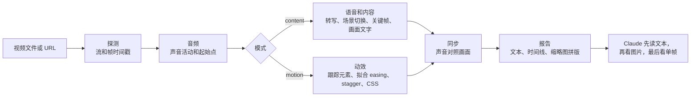

<!-- 语言栏。只列出已存在的 README 文件。译者：请在下面的标记之前按相同格式添加你的链接，例如 · <a href="README.ja.md">日本語</a> -->
<p align="center">
  <a href="README.md">English</a> · <a href="README.ko.md">한국어</a> · <a href="README.ja.md">日本語</a> · <b>简体中文</b> · <a href="README.zh-TW.md">繁體中文</a> · <a href="README.es.md">Español</a> · <a href="README.pt-BR.md">Português (Brasil)</a> · <a href="README.de.md">Deutsch</a> · <a href="README.fr.md">Français</a>
  <!-- i18n:languages -->
</p>

# video-lens

[](LICENSE)
[](#环境要求)
[](#安装)

一个测量视频而不是靠肉眼估计的 Claude Code 技能：把 UI 动画的时间和 easing 输出为 CSS，并给出带时间戳的场景、画面文字和语音。一切都在你的 Mac 上运行。

带交互式图表的网站：<https://junhan2.github.io/video-lens/>

## 目录

- [为什么需要它](#为什么需要它)
- [何时使用](#何时使用)
- [安装](#安装)
- [用法](#用法)
- [工作原理](#工作原理)
- [基准测试摘要](#基准测试摘要)
- [局限](#局限)
- [贡献与自检](#贡献与自检)
- [许可证](#许可证)

## 为什么需要它

Claude 无法观看视频。video-lens 逐帧测量视频，先把数字和文字交给 Claude，只在需要亲眼看一看的地方才给出图片。

- **UI 动效：** 每个动画元素的开始时间、时长、easing（具名曲线或 cubic-bezier）、错开延迟（stagger）和位移距离，精确到帧，并写成 CSS。
- **演讲和演示：** 场景切换、关键帧、韩文和英文画面文字（macOS Vision）、语音转写和音画同步，全部带时间戳。
- **不上传任何内容：** ffmpeg、OpenCV、macOS Vision、Apple 设备端语音识别和 whisper.cpp。

### 与 /watch 和 video-use 对比

| | /watch（claude-video 0.1.3） | video-use（browser-use） | video-lens |
|---|---|---|---|
| 查看的帧 | 最多每秒 2 帧、总共 100 帧 | 仅在它请求时提供：每个请求的时间区间 10 帧，宽 320 px | 每一帧 |
| 时间精度 | 整秒 | 语音有逐词时间戳；画面帧取自它请求的时间点 | 一帧（60 fps 下为 16.7 ms） |
| 一段 300 ms 的动画 | 0 或 1 帧 | 只有它采样到的帧；不测量运动 | 测得开始时间、时长、easing 和 CSS |
| 语音 | 若没有英文字幕，音频会上传到 Groq 或 OpenAI Whisper | 音频上传到 ElevenLabs Scribe（需付费 API key） | 在你的 Mac 上转写，包括韩语 |
| 场景切换和画面文字 | 不检测 | 不检测 | 切换时间点和每张幻灯片的文字 |

/watch 适合快速了解一段视频大概讲了什么。video-use 通过对话来剪辑视频：剪切、调色和字幕。video-lens 则用于弄清某件事何时发生、持续多久以及如何发生。在基准测试中，Opus 搭配 /watch 或 video-use 时的平均得分比搭配 video-lens 时略高一些，主要是因为它在技能之外还用自己写的 ffmpeg 和 OpenCV 代码亲自测量了片段；而它的花费是搭配 video-lens 时的两倍多。详情见[与其他视频技能对比](#与其他视频技能对比)。

示例：一段在无头 Chrome 中用真实 CSS 渲染出来的 3 秒 toast 录屏。video-lens 测得 298 ms（范围 284 到 313）和 `cubic-bezier(0.22, 1, 0.36, 1)`。CSS 中写的是 300 ms 和同一条曲线。

### 与单独使用模型对比

没有这个技能时，Claude 会为每个视频重新编写 ffmpeg 和 Python 代码来测量。这样往往可行，但每次运行的代码都不一样。我们用 9 个按标准答案评分的任务做了测试，每个任务运行 3 次，因此每种条件共 27 次运行，分别在搭配和不搭配 video-lens 的情况下进行。具体数字见[基准测试摘要](#基准测试摘要)。

<picture>
  <source media="(prefers-color-scheme: dark)" srcset="docs/assets/charts/cost-dark.png">
  
</picture>

<picture>
  <source media="(prefers-color-scheme: dark)" srcset="docs/assets/charts/time-dark.png">
  
</picture>

<picture>
  <source media="(prefers-color-scheme: dark)" srcset="docs/assets/charts/accuracy-dark.png">
  
</picture>

## 何时使用

适合用于：

- **重现或评审 UI 动效。** 开始时间、时长、easing 和 stagger 以数字和 CSS 给出，每项都附带可能的取值范围。“这个过渡真的是 400 ms ease-out 吗？”这样的问题，能得到基于测量的回答。
- **长录像。** <!-- long-lecture:start -->在 10 分钟的韩语讲座任务上，Claude Opus 5.5 搭配 video-lens：成本降低 30%，耗时降低 74%（3 次运行的中位数）。<!-- long-lecture:end -->
- **重复的动效。** 轮播和循环动画会作为一组只测量一次，并给出每次重复的开始时间。
- **私密的演讲和会议。** 语音在你的 Mac 上转写，幻灯片文字附带时间戳。

以下情况不需要它：

- **快速了解短片段的大意。** 单独使用模型就能搞定，加载技能还会多花一点成本。
- **Windows 或 Linux。** video-lens 只能在 macOS 上运行。
- **说话人标签、语言检测或音乐速度。** 这些都不支持。

## 安装

在 Claude Code 中：

```
/plugin marketplace add Junhan2/video-lens
/plugin install video-lens@video-lens
```

在终端中：

```
brew install ffmpeg
pip3 install opencv-python numpy
xcode-select --install   # 用于构建画面文字和语音识别的辅助程序
```

### 环境要求

| | 项目 | 说明 |
|---|---|---|
| 必需 | macOS | 已在搭载 Apple Silicon 的 macOS 26 上测试。 |
| 必需 | ffmpeg | |
| 必需 | Python 3，以及 opencv-python 和 numpy | 已用 Python 3.13 测试。缺少某个包时，会打印出确切的 pip 命令。 |
| 必需 | Xcode Command Line Tools | 用于构建画面文字和语音识别的辅助程序。 |
| 可选 | macOS 26 | 设备端语音识别（Apple SpeechTranscriber）。 |
| 可选 | whisper-cpp 和一个 ggml 模型 | 例如把 `ggml-large-v3-turbo-q5_0.bin` 放在 `~/.local/share/whisper/` 中，用于以 whisper 转写。 |
| 可选 | Node 24 和 Google Chrome | 读取网页中声明的 CSS 动画，并与测量结果对比。 |
| 可选 | yt-dlp | 分析来自 URL 的视频。 |

## 用法

像平常一样提问即可。问题需要测量时，Claude 会自动选用这个技能。若要直接调用，在消息开头加上 `/video-lens`。

```
分析这段录屏里的动画，方便我用 CSS 重现
列出这场讲座里每张幻灯片出现的时间和内容
12:00 前后说了什么？
用截图逐个场景总结这个 YouTube 演讲
```

在一项提示词中不点名技能的测试里，Opus 5.5 在 9 个任务中有 8 个自行选用了它。

当多个元素同时运动时，请指明区域，例如“只看左边的列表”。Claude 随后会用 `--roi` 缩小测量范围。

### 场景摘要，仅在你要求时生成

如果你要求按场景附截图做摘要，Claude 会生成 `digest.md` 和一个自包含的 `digest.html`：每个场景一张截图，用一两行说明发生了什么、说了什么，并附上跳到该时刻的链接。带章节的 YouTube 视频按章节拆分。在一段 66 分钟、含 21 个章节的韩语演讲上，整个过程在 Mac 上约用了 4 分钟（下载、分析和生成摘要）。普通分析从不生成摘要。

## 工作原理

只需一条命令 `vl.py analyze`，就能测量视频并输出一份最多 6,000 个字符的文本报告。Claude 先读这份报告，然后看几张带标注的图片，只在必要时才查看单帧。



- **模式：** 不超过 2 分钟的安静片段按动效（motion）测量，更长的按内容（content）测量，有声音的短片段两种都做。
- **语音来源顺序：** 先用字幕流，其次是外挂的 `.srt` 或 `.vtt` 字幕文件，然后是设备端的 Apple SpeechTranscriber，最后是 whisper.cpp。音频从不上传。
- **动效：** OpenCV 找出运动的元素并逐帧跟踪；开始时间、时长、easing、错开延迟和位移距离都经过拟合，同时报告取值范围和难分高下的候选结果。

## 基准测试摘要

<!-- results:start -->
<!-- Generated from docs/data/benchmark.json by tools/render_results.py. Do not edit by hand. -->

| 模型 | 条件 | 平均分 | 最差一次 | 得 1.0 的次数 | 平均每次成本 | 平均每次耗时 | 平均轮次 |
| --- | --- | ---: | ---: | ---: | ---: | ---: | ---: |
| Claude Opus 5.5 | 单独使用模型 | 0.949 | 0.167 | 21/27 | $0.859 | 420.2 s | 17.5 |
| Claude Opus 5.5 | 搭配 video-lens | 0.956 | 0.800 | 15/27 | $0.663 | 265.1 s | 10.1 |
| Claude Sonnet 5.5 | 单独使用模型 | 0.970 | 0.600 | 22/27 | $0.626 | 287.9 s | 20.9 |
| Claude Sonnet 5.5 | 搭配 video-lens | 0.940 | 0.625 | 15/27 | $0.408 | 121.8 s | 10.0 |
| Grok 4.7 | 单独使用模型 | 0.819 | 0.000 | 14/27 | $0.444 | 785.0 s | 23.3 |
| Grok 4.7 | 搭配 video-lens | 0.942 | 0.667 | 14/27 | $0.324 | 1055.9 s | 17.7 |

- Claude Opus 5.5 搭配 video-lens：成本降低 23%，耗时降低 37%。
- Claude Sonnet 5.5 搭配 video-lens：成本降低 35%，耗时降低 58%。
- Grok 4.7 搭配 video-lens：成本降低 27%，耗时增加 35%。

测量时间：2026-09-29 至 2026-10-01。9 个任务 × 3 次 = 每种条件 27 次运行，不接 MCP 服务器，每次只跑一个。平均分、成本、耗时和轮次均为所有运行的平均值；最差一次是单次运行的最低得分。

- Claude Opus 5.5：在 Claude Code 中运行，effort 为 high。成本为 Claude Code 报告的、按 API 价格折算的 `total_cost_usd`。耗时为 Claude Code 报告的运行时长。
- Claude Sonnet 5.5：在 Claude Code 中运行，effort 为 high。成本为 Claude Code 报告的、按 API 价格折算的 `total_cost_usd`。耗时为 Claude Code 报告的运行时长。
- Grok 4.7：在 Grok Build CLI 中运行，effort 为 xhigh。成本为 Grok Build CLI 报告的、按 API 价格折算的 `total_cost_usd`。耗时为运行的实际经过时间（墙钟时间）。

<!-- results:end -->

Grok 4.7 搭配 video-lens 的耗时只是粗略数据：这些运行在测试过程中有一段时间与其他繁重任务共用同一台 Mac，其中一次耗时 4.3 小时。它的耗时中位数为 446 s，单独使用时为 778 s。

<picture>
  <source media="(prefers-color-scheme: dark)" srcset="docs/assets/charts/tasks-dark.png">
  
</picture>

### 与其他视频技能对比

<!-- skills:start -->
<!-- Generated from docs/data/benchmark.json by tools/render_results.py. Do not edit by hand. -->

Claude Opus 5.5 分别搭配各个视频技能，在相同的 9 个任务和提示词上运行，每种条件 27 次，每次只跑一个。每次运行都在提示词中点名所用的技能，且在其他技能的运行中隐藏了 video-lens。

| 条件 | 平均分 | 最差一次 | 得 1.0 的次数 | 平均每次成本 | 平均每次耗时 | 平均轮次 | 使用自写分析代码的次数 |
| --- | ---: | ---: | ---: | ---: | ---: | ---: | ---: |
| 单独使用模型 | 0.949 | 0.167 | 21/27 | $0.859 | 420.2 s | 17.5 | 26/27 |
| 搭配 video-lens | 0.956 | 0.800 | 15/27 | $0.663 | 265.1 s | 10.1 | 2/27 |
| 搭配 /watch | 0.984 | 0.800 | 23/27 | $1.773 | 590.0 s | 34.7 | 24/27 |
| 搭配 video-use | 0.969 | 0.467 | 23/27 | $1.569 | 487.2 s | 22.1 | 27/27 |

- /watch（claude-video 0.1.3）每秒最多查看 2 帧，并把语音发送到 Groq 或 OpenAI Whisper API。
- video-use（browser-use/video-use b877063）是为剪辑视频而设计的，不是为了测量视频。它把语音发送到 ElevenLabs Scribe，并查看由帧拼成的胶片条。这些任务只测试它读懂视频的能力。
- 自写分析代码：指 Opus 在技能自带工具之外，还自己编写并运行了 ffmpeg、OpenCV 或 whisper 命令的运行。大多数 /watch 和 video-use 的运行都这样做了，它们多出的成本和时间就花在这里。搭配 video-lens 时，技能给出的测量结果通常就够用了。
- 成本只计入 Claude Code 为模型报告的费用。/watch（Groq 或 OpenAI）和 video-use（ElevenLabs）调用的语音 API 记在它们各自的 key 上，不包含在内。

<!-- skills:end -->

标准答案来自两类素材：在无头 Chrome 中逐帧渲染的真实 CSS 动画（真值就是写出来的 CSS），以及用 macOS 文字转语音朗读的讲座；轮播任务是一段真实录屏，只有近似的标准答案。容差：开始时间和时长 ±1 帧，easing 与真实曲线相差在 0.05 以内，声音 ±10 ms，语音时间 ±150 ms。

方法、各任务结果和注意事项：[docs/BENCHMARK.md](docs/BENCHMARK.md)。脚本和原始结果：[bench/](bench/README.md)。

## 局限

- 多个元素同时运动时，第一轮测量可能把它们合并成一个框，或拆成碎片。用 `--roi` 缩小区域即可解决。在基准测试中，Opus 5.5 自行这样做了；Sonnet 5.5 这样做的次数较少。
- 照片或渐变背景上的运动，以及嘈杂的真实场景语音，目前测试还不充分。
- 不支持说话人标签、语言自动检测或音乐速度。
- 30 fps 的录屏会让时间分辨率减半。条件允许时请用 60 fps 录制。
- 仅支持 macOS，已在搭载 Apple Silicon 的 macOS 26 上测试。

## 贡献与自检

- **自检：** `python3 skills/video-lens/scripts/vl.py selftest` 会在合成片段上运行已知答案的检查，任何一项失败都以退出码 1 结束。`--quick` 运行一组更短的检查。
- **基准测试数字**都放在一个文件里：[`docs/data/benchmark.json`](docs/data/benchmark.json)。其中每个模型都有一个 `settings` 块（运行环境、effort、成本和耗时的取得方式），各模型的设置说明就是据此生成的。修改该文件后，运行 `python3 tools/render_results.py`（它会重写每个 README 和 BENCHMARK 文件中 `results`、`per-task`、`tasks` 和 `long-lecture` 标记之间的文字，以及 `docs/index.html` 中计算得出的句子；加 `--check` 则只报告、不改写）和 `node tools/render_charts.mjs`（用无头 Chrome 重新渲染图表图片）。
- **翻译：** 把 `docs/i18n/en.json` 复制为 `docs/i18n/<lang>.json`，翻译其中的值，把该语言加入 `docs/i18n/languages.json`，然后运行 `python3 tools/i18n.py check`。如需翻译 README，创建带有相同标记的 `README.<lang>.md` 并运行 `python3 tools/render_results.py`，其中的表格就会使用你的标签。修改 `en.json` 或 `languages.json` 后，运行 `python3 tools/i18n.py sync` 和 `python3 tools/render_results.py`，让页面内置的英文和语言链接保持一致。

## 许可证

[MIT](LICENSE)
