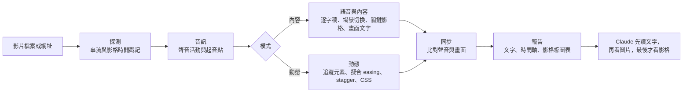

<!-- 語言列。只列出實際存在的 README 檔案。譯者：請在下方標記之前，以相同格式加入你的連結，例如 · <a href="README.ja.md">日本語</a> -->
<p align="center">
  <a href="README.md">English</a> · <a href="README.ko.md">한국어</a> · <a href="README.ja.md">日本語</a> · <a href="README.zh-CN.md">简体中文</a> · <b>繁體中文</b> · <a href="README.es.md">Español</a> · <a href="README.pt-BR.md">Português (Brasil)</a> · <a href="README.de.md">Deutsch</a> · <a href="README.fr.md">Français</a>
  <!-- i18n:languages -->
</p>

# video-lens

[](LICENSE)
[](#系統需求)
[](#安裝)

這是一個用量測取代目測來看影片的 Claude Code 技能：把 UI 動畫的時序與 easing 寫成 CSS，並為場景、畫面文字和語音附上時間戳記。一切都在你的 Mac 上執行。

附互動圖表的網站：<https://junhan2.github.io/video-lens/>

## 目錄

- [為什麼需要它](#為什麼需要它)
- [使用時機](#使用時機)
- [安裝](#安裝)
- [使用方式](#使用方式)
- [運作方式](#運作方式)
- [基準測試摘要](#基準測試摘要)
- [限制](#限制)
- [貢獻與自我測試](#貢獻與自我測試)
- [授權](#授權)

## 為什麼需要它

Claude 沒辦法觀看影片。video-lens 逐格量測影片，先把數字和文字交給 Claude，只在需要親眼確認的地方才提供圖片。

- **UI 動態**：每個動畫元素的起始時間、持續時間、easing（具名曲線或 cubic-bezier）、錯開時間（stagger）與移動距離，精確到影格，並寫成 CSS。
- **演講與示範影片**：場景切換、關鍵影格、韓文與英文畫面文字（macOS Vision）、語音逐字稿，以及聲音與畫面的同步，全都附上時間戳記。
- **不上傳任何東西**：ffmpeg、OpenCV、macOS Vision、Apple 裝置端語音辨識與 whisper.cpp。

### 與 /watch 和 video-use 比較

| | /watch (claude-video 0.1.3) | video-use (browser-use) | video-lens |
|---|---|---|---|
| 看過的影格 | 每秒最多 2 個，總共 100 個 | 在它要求時，每個指定範圍 10 個影格，寬 320 px | 每一個影格 |
| 時間精度 | 整秒 | 語音有逐字的時間戳記；影格則取在它要求的時間點 | 一個影格（60 fps 下為 16.7 ms） |
| 一段 300 ms 的動畫 | 0 或 1 個影格 | 只有它取樣到的影格；不量測動態 | 量測起始時間、持續時間、easing，並產生 CSS |
| 語音 | 除非已有英文字幕，否則把音訊上傳到 Groq 或 OpenAI Whisper | 把音訊上傳到 ElevenLabs Scribe（需付費 API 金鑰） | 在你的 Mac 上轉寫，包括韓語 |
| 場景切換與畫面文字 | 不偵測 | 不偵測 | 切換的時間點，以及每張投影片上的文字 |

/watch 適合快速了解一部影片大概在講什麼。video-use 透過對話來剪輯影片：剪接、調色和字幕。video-lens 則是用在想知道某件事何時發生、持續多久、怎麼發生的時候。在基準測試中，Opus 搭配 /watch 或 video-use 的平均分數比搭配 video-lens 略高一些，主要是因為它除了使用技能之外，還另外用自己寫的 ffmpeg 和 OpenCV 程式碼量測影片；而它的成本是搭配 video-lens 時的兩倍以上。詳見：[與其他影片技能比較](#與其他影片技能比較)。

範例：一段在 headless Chrome 中用真實 CSS 渲染出來的 3 秒 toast 通知錄影。video-lens 量測到 298 ms（範圍 284 至 313）和 `cubic-bezier(0.22, 1, 0.36, 1)`。CSS 裡寫的是 300 ms 和同一條曲線。

### 與只用模型比較

沒有這個技能時，Claude 每遇到一部影片，都會重新寫一套 ffmpeg 和 Python 程式碼來量測。這樣常常行得通，但每次執行寫出的程式碼都不一樣。我們準備了 9 個以標準答案評分的任務，每個跑 3 次，所以每種條件共 27 次執行，分別在不搭配和搭配 video-lens 的情況下進行。數字列在[基準測試摘要](#基準測試摘要)。

<picture>
  <source media="(prefers-color-scheme: dark)" srcset="docs/assets/charts/cost-dark.png">
  
</picture>

<picture>
  <source media="(prefers-color-scheme: dark)" srcset="docs/assets/charts/time-dark.png">
  
</picture>

<picture>
  <source media="(prefers-color-scheme: dark)" srcset="docs/assets/charts/accuracy-dark.png">
  
</picture>

## 使用時機

適合用在：

- **重建或審查 UI 動態。** 以數字和 CSS 給出起始時間、持續時間、easing 與 stagger，每個值都附上它可能落在的範圍。「這個轉場真的是 400 ms ease-out 嗎？」這類問題，會得到實際量測的答案。
- **長時間錄影。** <!-- long-lecture:start -->在 10 分鐘的韓語講座上，Claude Opus 5.5 搭配 video-lens：成本降低 30%，時間降低 74%（3 次執行的中位數）。<!-- long-lecture:end -->
- **重複的動態。** 輪播和循環動畫會當作一組量測一次，並列出每次重複的起始時間。
- **不公開的演講與會議。** 語音在你的 Mac 上轉寫，投影片文字也附有時間戳記。

以下情況用不到它：

- **快速掌握短片大意。** 只用模型就能處理，而載入技能會多花一點成本。
- **Windows 或 Linux。** video-lens 只能在 macOS 上執行。
- **說話者標記、語言偵測或音樂節拍。** 這些都不支援。

## 安裝

在 Claude Code 中：

```
/plugin marketplace add Junhan2/video-lens
/plugin install video-lens@video-lens
```

在終端機中：

```
brew install ffmpeg
python3 -m pip install opencv-python numpy
xcode-select --install   # 建置畫面文字與語音的輔助程式
```

### 系統需求

| | 項目 | 說明 |
|---|---|---|
| 必要 | macOS | 已在搭載 Apple Silicon 的 macOS 26 上測試。 |
| 必要 | ffmpeg | |
| 必要 | Python 3.10 或更新版本，並裝有 opencv-python 與 numpy | 已在 Python 3.13、OpenCV 4.12 與 numpy 2.2 上測試。若 pip 以 `externally-managed-environment` 拒絕安裝（Homebrew 的 Python），請加上 `--user --break-system-packages`。缺少套件或 Python 版本太舊時，會印出確切的修正方法。 |
| 必要 | Xcode Command Line Tools | 用來建置畫面文字與語音的輔助程式。 |
| 選用 | macOS 26 | 裝置端語音辨識（Apple SpeechTranscriber）。 |
| 選用 | whisper-cpp 與一個 ggml 模型 | 例如把 `ggml-large-v3-turbo-q5_0.bin` 放在 `~/.local/share/whisper/`，用 whisper 轉寫時需要。 |
| 選用 | Node 24 與 Google Chrome | 讀取網頁宣告的 CSS 動畫，並與量測結果比較。 |
| 選用 | yt-dlp | 分析網址上的影片。 |

## 使用方式

照平常的方式提問就好。問題需要量測時，Claude 會自動選用這個技能。若要直接呼叫，請以 `/video-lens` 作為訊息的開頭。

```
分析這段螢幕錄影裡的動畫，讓我能用 CSS 重做出來
列出這場講座中每張投影片出現的時間和上面寫了什麼
12:00 左右講了什麼？
把這部 YouTube 演講逐場景摘要，並附上截圖
```

在一項提示詞沒有指名技能的測試中，Opus 5.5 在 9 個任務中有 8 個自行選用了它。

若有好幾個元素同時移動，請指出要看的範圍，例如「只看左邊的清單」。Claude 就會用 `--roi` 縮小量測範圍。

### 逐場景摘要（只在你要求時產生）

要求附截圖的逐場景摘要時，Claude 會寫出 `digest.md` 和一個獨立完整的 `digest.html`：每個場景一張截圖、用一兩行說明發生了什麼、說了什麼，以及跳到該時間點的連結。有章節的 YouTube 影片會依章節切分。一場 66 分鐘、有 21 個章節的韓語演講，在 Mac 上大約花了 4 分鐘（下載、分析和摘要）。一般的分析從不產生摘要。

## 運作方式

只要一個指令 `vl.py analyze`，就會量測影片並輸出最多 6,000 個字元的文字報告。Claude 先讀這份報告，再看幾張有標註的圖片，只在必要時才看單一影格。



- **模式**：2 分鐘以內的安靜片段以動態模式量測，較長的以內容模式量測，有聲音的短片段則兩者都做。
- **語音來源的順序**：先用字幕串流，其次是影片旁的外掛字幕檔 `.srt` 或 `.vtt`，再來是裝置端的 Apple SpeechTranscriber，最後是 whisper.cpp。音訊絕不上傳。
- **動態**：OpenCV 找出移動的元素，並逐格追蹤；起始時間、持續時間、easing、stagger 和移動距離經過擬合，同時回報數值範圍與難分高下的候選結果。

## 基準測試摘要

<!-- results:start -->
<!-- Generated from docs/data/benchmark.json by tools/render_results.py. Do not edit by hand. -->

| 模型 | 條件 | 平均分數 | 最差一次 | 得 1.0 分的次數 | 每次平均成本 | 每次平均時間 | 平均回合數 |
| --- | --- | ---: | ---: | ---: | ---: | ---: | ---: |
| Claude Opus 5.5 | 只用模型 | 0.949 | 0.167 | 21/27 | US$0.859 | 420.2 s | 17.5 |
| Claude Opus 5.5 | 搭配 video-lens | 0.956 | 0.800 | 15/27 | US$0.663 | 265.1 s | 10.1 |
| Claude Sonnet 5.5 | 只用模型 | 0.970 | 0.600 | 22/27 | US$0.626 | 287.9 s | 20.9 |
| Claude Sonnet 5.5 | 搭配 video-lens | 0.940 | 0.625 | 15/27 | US$0.408 | 121.8 s | 10.0 |
| Grok 4.7 | 只用模型 | 0.819 | 0.000 | 14/27 | US$0.444 | 785.0 s | 23.3 |
| Grok 4.7 | 搭配 video-lens | 0.942 | 0.667 | 14/27 | US$0.324 | 1055.9 s | 17.7 |

- Claude Opus 5.5 搭配 video-lens：成本降低 23%，時間降低 37%。
- Claude Sonnet 5.5 搭配 video-lens：成本降低 35%，時間降低 58%。
- Grok 4.7 搭配 video-lens：成本降低 27%，時間增加 35%。

量測期間 2026-09-29 至 2026-10-01。9 個任務 × 3 次 = 每種條件 27 次執行，不啟用 MCP 伺服器，一次只跑一個。平均分數、成本、時間與回合數是所有執行的平均值；最差一次是單次執行中最低的分數。

- Claude Opus 5.5：在 Claude Code 中執行，effort 為 high。成本是 Claude Code 回報的 API 等值金額 `total_cost_usd`。時間是 Claude Code 回報的執行時間。
- Claude Sonnet 5.5：在 Claude Code 中執行，effort 為 high。成本是 Claude Code 回報的 API 等值金額 `total_cost_usd`。時間是 Claude Code 回報的執行時間。
- Grok 4.7：在 Grok Build CLI 中執行，effort 為 xhigh。成本是 Grok Build CLI 回報的 API 等值金額 `total_cost_usd`。時間是該次執行從開始到結束實際經過的時間。

<!-- results:end -->

Grok 4.7 搭配 video-lens 的時間只是粗略的數字：在這輪測試的部分時間裡，這些執行和其他繁重的工作共用同一台 Mac，其中一次花了 4.3 小時。它的時間中位數是 446 s，只用模型時是 778 s。

<picture>
  <source media="(prefers-color-scheme: dark)" srcset="docs/assets/charts/tasks-dark.png">
  
</picture>

### 與其他影片技能比較

<!-- skills:start -->
<!-- Generated from docs/data/benchmark.json by tools/render_results.py. Do not edit by hand. -->

Claude Opus 5.5 分別搭配各個影片技能，執行相同的 9 個任務與提示詞，每種條件 27 次，一次只跑一個。每次執行都在提示詞中指名所用的技能，而在其他技能的執行中，video-lens 是隱藏起來的。

| 條件 | 平均分數 | 最差一次 | 得 1.0 分的次數 | 每次平均成本 | 每次平均時間 | 平均回合數 | 自寫分析程式的次數 |
| --- | ---: | ---: | ---: | ---: | ---: | ---: | ---: |
| 只用模型 | 0.949 | 0.167 | 21/27 | US$0.859 | 420.2 s | 17.5 | 26/27 |
| 搭配 video-lens | 0.956 | 0.800 | 15/27 | US$0.663 | 265.1 s | 10.1 | 2/27 |
| 搭配 /watch | 0.984 | 0.800 | 23/27 | US$1.773 | 590.0 s | 34.7 | 24/27 |
| 搭配 video-use | 0.969 | 0.467 | 23/27 | US$1.569 | 487.2 s | 22.1 | 27/27 |

- /watch（claude-video 0.1.3）每秒最多看 2 個影格，並把語音送到 Groq 或 OpenAI Whisper API。
- video-use（browser-use/video-use b877063）是為了剪輯影片而設計，不是為了量測。它把語音送到 ElevenLabs Scribe，並以影格膠卷條（filmstrip）的方式看畫面。這些任務只測試它讀懂影片的能力。
- 自寫分析程式：除了技能本身的工具之外，Opus 還自己寫並執行 ffmpeg、OpenCV 或 whisper 指令的執行次數。大多數 /watch 和 video-use 的執行都這麼做了，多出來的成本和時間就是花在這裡。搭配 video-lens 時，技能的量測結果通常就已足夠。
- 成本只計算 Claude Code 為模型回報的金額。/watch（Groq 或 OpenAI）與 video-use（ElevenLabs）呼叫的語音 API，是用它們各自的金鑰計費，不包含在內。

<!-- skills:end -->

標準答案來自在 headless Chrome 中逐格渲染的真實 CSS 動畫（正確答案就是 CSS 裡寫的值），以及使用 macOS 文字轉語音配上旁白的講座；輪播任務是真實錄影，標準答案為近似值。容許誤差：起始時間與持續時間 ±1 個影格，easing 與真實曲線相差 0.05 以內，聲音 ±10 ms，語音時間 ±150 ms。

方法、各任務結果與注意事項：[docs/BENCHMARK.md](docs/BENCHMARK.md)。腳本與原始結果：[bench/](bench/README.md)。

## 限制

- 好幾個元素同時移動時，第一輪分析可能會把它們合併成一個框，或拆成好幾塊碎片。用 `--roi` 縮小範圍就能解決。在基準測試中，Opus 5.5 自行這麼做了；Sonnet 5.5 這麼做的次數比較少。
- 照片或漸層背景上的動態，以及嘈雜的真實環境語音，測試都還不夠充分。
- 不支援說話者標記、語言自動偵測或音樂節拍。
- 30 fps 的錄影會讓時間解析度減半。可以的話，請以 60 fps 錄影。
- 僅支援 macOS，已在搭載 Apple Silicon 的 macOS 26 上測試。

## 貢獻與自我測試

- **自我測試**：`python3 skills/video-lens/scripts/vl.py selftest` 會在合成的影片片段上執行已知答案的檢查，只要有任何一項失敗，就以結束代碼 1 結束。`--quick` 只執行較短的一組檢查。
- **基準測試的數字**集中在一個檔案：[`docs/data/benchmark.json`](docs/data/benchmark.json)。其中每個模型都有一個 `settings` 區塊（執行工具、effort、成本與時間的取得方式），各模型的設定說明就是由它產生的。修改這個檔案後，請執行 `python3 tools/render_results.py`（會改寫所有 README 與 BENCHMARK 檔案中 `results`、`per-task`、`tasks` 和 `long-lecture` 標記之間的文字，以及 `docs/index.html` 中計算出來的句子；加上 `--check` 則只回報、不修改）和 `node tools/render_charts.mjs`（用 headless Chrome 重新繪製圖表圖片）。
- **翻譯**：把 `docs/i18n/en.json` 複製成 `docs/i18n/<lang>.json`，翻譯其中的值，把語言加入 `docs/i18n/languages.json`，然後執行 `python3 tools/i18n.py check`。若要翻譯 README，請建立含有相同標記的 `README.<lang>.md`，再執行 `python3 tools/render_results.py`，表格就會改用你的標籤。修改 `en.json` 或 `languages.json` 後，請執行 `python3 tools/i18n.py sync` 和 `python3 tools/render_results.py`，讓頁面內建的英文和語言連結保持一致。

## 授權

[MIT](LICENSE)
